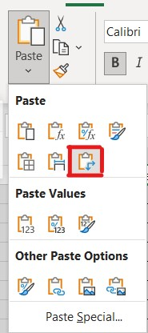
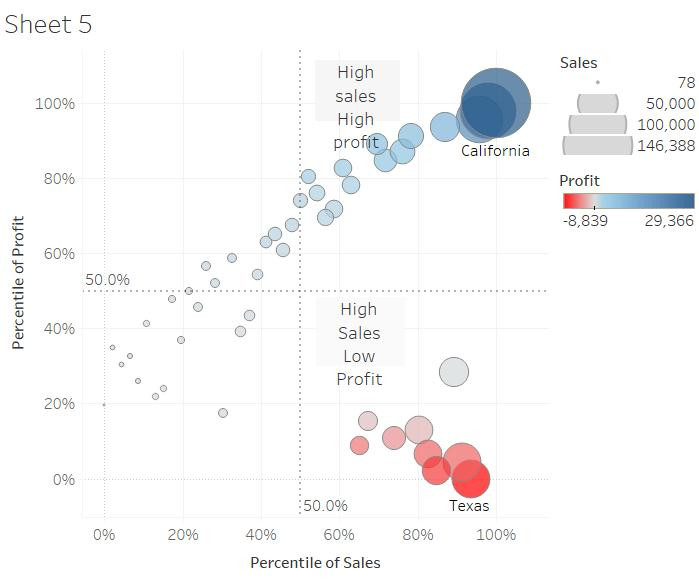

```{r setup, include=FALSE}
knitr::opts_chunk$set(echo = FALSE)
```

# 1. Critiques for Original Visualization

Singapore is a country with large volumes of import and export transactions with various countries/regions. In order to show the merchandise trade of six major trading countries/regions, below graph was originally designed as the visualization of import and export trade data provided by Department of Statistics, Singapore (DOS).


_Fig.1 Original Visualization_

However, this graph is not a good visualization sample for this topic. I criticized above graph from two aspects, clarity and aesthetics, and explained the reason why it's not good enough.

### 1.1 Clarity

Clarity is to describe how quickly and effectively it imparts to the audience an accurate understanding of some fundamental truth about the real world. For the original graph, there are several points that I think is not meet the requirement of clarity.

**No** | **Critiques**
-------|------------------------------------------------------------------------------------------------------------
1      | **Inconsistent range of vertical axis scale.** The range of vertical axis scales for each country/region and export/import do not remain the same, thus users can neither compare trading trends between countries/regions nor trade gaps between export and import within one country/region.
2      | **Rough scale division of horizontal axis without tick marks.** The label of horizontal axis only shows the year, and the scale division of horizontal axis is not detailed enough, though the horizontal axis title is called "Month of Period", so it's hard to see exactly which month or quarter the data belongs to.
3      | **Misleading label of horizontal axis.** The last label of horizontal axis is 2021 for countries/regions except for Japan, whereas the only data in 2019-2020 is used for visualization, which will confuse audience exactly which periods of data are intended to show.
4      |**Wrong chart type is used in this graph.** The figures of export data are covered by the colored area of importing figures, which makes it hard to see the single trend of export or import trade for countries/regions, especially when export trade trend and import trade trend of a country/region are quite similar.
5      |**No lead-in statement for the chart.** A proper lead-in that provide proper background or further elucidation can give audiences clearer recognition of data, which is not included in the graph. Thus the audiences won't know which currency the data are, how the data are selected for visualization, or the purpose of the graph.
6      |**Improper graph title. **According to my calculation, Indonesia has the 6th highest total number of import and export trade with Singapore during 2019-2022, that is higher then Japan. Thus the graph title "Merchandise Trade of Top Six Trading Countries" is not quite proper.

### 1.2 Aesthetic

The point of Aesthetic is to make the graph looks beautiful. Although the standard of "beauty" is different for everyone, at least we can think the visualization is more beautiful when the graph looks neat and clear, then audiences would like to pay more attention to the graph. In that case, some subtle adjustment is always matter, for example, font and color choices for the graph.  Thus, I have came up with several points on why the original graph is not beautiful enough.

**No.**| **Critiques**
-------|------------------------------------------------------------------------------------------------------------
1      |**The chart horizontal axes are not in the same size.** The length of horizontal axes are different for each country/region which makes the graph looks not neat enough.
2      |**The number of axis label is not the same between each country/region and data labels are not aligned.** For instance, Mainland China's chart has 4 or 5 ladles for vertical axis and 3 for horizontal axis, whereas Japan's chart has 3 labels for vertical axis and 1 for horizontal axis. And labels for both vertical and horizontal axis are not aligned. Thus the charts looks untidy. 
3      |**The font size of the graph title is smaller then the country/region titles.** In this case audiences would notice the country/region titles instead of the graph title at the first glance, which is a bit distracting.
4      |**The plot area overlaps too much.** The colors of overlapped area look not good, and overlapped trend edges look messy.

# 2. Alternative Design

### 2.1 Sketch

The following picture shows the initial design sketch for the visualization of above topic:

 
_Fig.2 Sketch of alternative design_

### 2.2 Advantages of proposed design

The advantages and issues the proposed design try to overcome are listed below:

**NO.**|**Aspect**      |**Advantages**
-------|----------------|-------------------------------------------------------------------------------
1      |Clarity         |**Consistent range scale of vertical axis for import and export trade, and clear division of quarter and year in horizontal axis.** Audiences can easily compare either the trading trade between different countries/regions, or the gap of import and export trade within a country/region, in particular quarters.
2      |Clarity         |**Correct and exact labels of horizontal axis.** Now the horizontal axis labels show the correct period to be analyzed. And audiences can easily distinguish which quarter the values are belong to.
3      |Clarity         |**Display the quarterly trade data point with different shapes and colors, and draw the bridge between export and import trade.** Using different colors to show the country/region, and shapes to differentiate the trade type. Quarterly bridges are drawn between import and export data points, which makes it clearer to show and compare the gap of the two types of trade in each quarter.
4      |Clarity         |**Proper graph title, lead-in verbiage and annotations.** This proposed design includes a proper title and description of the background, purpose and currency of visualization. It will give audiences a clearer recognition of information passed by the graph. Besides, some annotations could make audiences focus on special points.
5      |Aesthetic       |**Neat and tidy layout of graph.** All countries/regions are evenly assigned to separate paralleled panes. And the axis labels are all in the same numbers for each country/region.
6      |Aesthetic       |**Good color matching and shape assortment without too much overlapped area.** The selected colors and shapes for plot area look comfortable, and grid lines are in light gray which won't distract the audience attention. Without too much overlapped area, the entire graph also looks cleaner.

# 3. Step-by-step Guide

### 3.1 Data preparation steps

**NO.**|**Step**          |**Action**
-------|------------------|----------------------------------------------------------------------------------
1      |Prepare the data to be imported in Tableau. |The raw file downloaded contains export and import data since 1976 Jan, so the first step is select all countries/regions data between 2019 Jan and 2020 December, copy the selection and paste with transposing into a new workbook called "data_cleaned". <br>  <br> _Fig.3 Paste with transposing_ <br> The export and import data are pasted in different sheets, named "Export" and "Import" respectively. Then change the "Variables" column header as "Period".
2      |


First, let us import the data into R by using read_csv() of readr package.  

### 3.2 Data Visualization steps


# 4. Final Visualization


# 5. Major Observations


Before you get started, you are required:

* to start a new R project, and
    * to create a new R Markdown document.

Figure below shows the quadrant plot of Tableau.



Next, you will use the code chunk below to install and launch ggpubr and tidyverse in RStudio.

# R code 
packages = c('ggpubr', 'tidyverse')

for(p in packages){library
  if(!require(p, character.only = T)){
    install.packages(p)
  }
  library(p, character.only = T)
}


In this hands-on exercise, the [Wine Quality Data Set](https://archive.ics.uci.edu/ml/datasets/wine+quality) of UCI Machine Learning Repository will be used.  The data set consists of 13 variables and 6497 observations.  For the purpose of this exercise, we have combined the red wine and white wine data into one data file.  It is called wine_quality and is in csv file format.  

# R code
wine <- read_csv("data/wine_quality.csv")


Notice that beside quality and type, the rest of the variables are numerical and continuous data type. 


In the figure below, multiple histograms are plottted by using ggplot() and geom_histogram() of ggplot2 package.  Then, ggarrange() of ggpubr package is used to patch these histogram into a single figure to reveal the distribution of the selected variables in the wine quality data sets.  

# Rcode
fa <- ggplot(data=wine, aes(x= `fixed acidity`)) +
  geom_histogram(bins=20, color="black", fill="light blue")
va <- ggplot(data=wine, aes(x= `volatile acidity`)) +
  geom_histogram(bins=20, color="black", fill="light blue")
ca <- ggplot(data=wine, aes(x= `citric acid`)) +
  geom_histogram(bins=20, color="black", fill="light blue")
rs <- ggplot(data=wine, aes(x= `residual sugar`)) +
  geom_histogram(bins=20, color="black", fill="light blue")
ch <- ggplot(data=wine, aes(x= `chlorides`)) +
  geom_histogram(bins=20, color="black", fill="light blue")
fSO2 <- ggplot(data=wine, aes(x= `free sulfur dioxide`)) +
  geom_histogram(bins=20, color="black", fill="light blue")
tSO2 <- ggplot(data=wine, aes(x= `total sulfur dioxide`)) +
  geom_histogram(bins=20, color="black", fill="light blue")
density <- ggplot(data=wine, aes(x= density)) +
  geom_histogram(bins=20, color="black", fill="light blue")
pH <- ggplot(data=wine, aes(x= pH)) +
  geom_histogram(bins=20, color="black", fill="light blue")
sulphates <- ggplot(data=wine, aes(x= sulphates)) +
  geom_histogram(bins=20, color="black", fill="light blue")
alcohol <- ggplot(data=wine, aes(x= alcohol)) +
  geom_histogram(bins=20, color="black", fill="light blue")

ggarrange(fa, va, ca, rs, ch, fSO2, tSO2, density, pH, sulphates, alcohol, 
          ncol = 4, nrow = 3)


