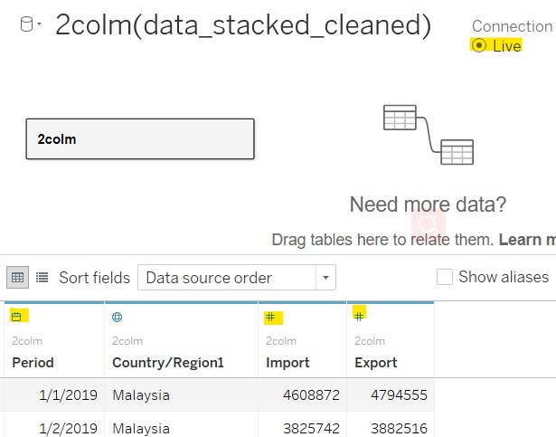
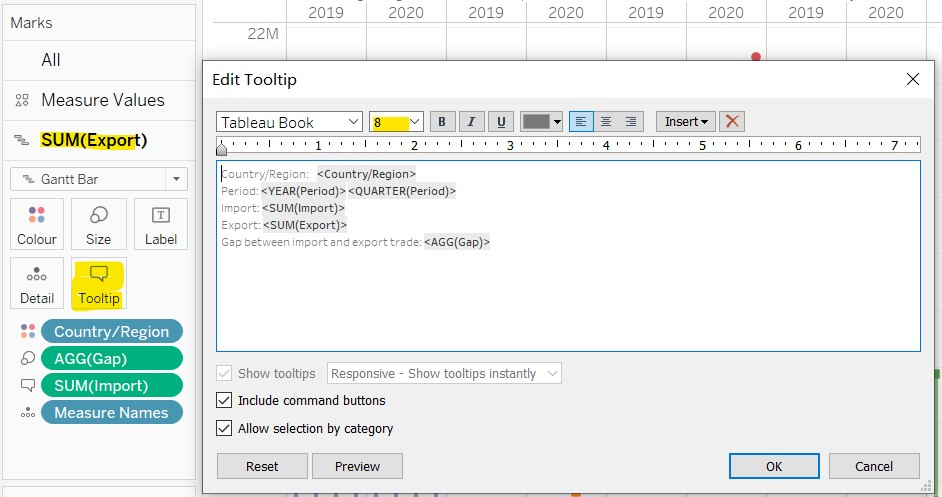

```{r setup, include=FALSE}
knitr::opts_chunk$set(echo = FALSE)
```

# 1. Critiques for Original Visualization

Singapore is a country with large volumes of import and export transactions with various countries/regions. In order to show the merchandise trade of six major trading countries/regions, below graph was originally designed as the visualization of import and export trade data provided by Department of Statistics, Singapore (DOS).


_Fig.1 Original Visualization_

However, this graph is not a good visualization sample for this topic. I criticized above graph from two aspects, clarity and aesthetics, and explained the reason why it's not good enough.

### 1.1 Clarity

Clarity is to describe how quickly and effectively it imparts to the audience an accurate understanding of some fundamental truth about the real world. For the original graph, there are several points that I think is not meet the requirement of clarity.

**No** | **Critiques**
-------|------------------------------------------------------------------------------------------------------------
1      | **Inconsistent range of vertical axis scale.** The range of vertical axis scales for each country/region and export/import do not remain the same, thus users can neither compare trading trends between countries/regions nor trade gaps between export and import within one country/region.
2      | **Rough scale division of horizontal axis without tick marks.** The label of horizontal axis only shows the year, and the scale division of horizontal axis is not detailed enough, though the horizontal axis title is called "Month of Period", so it's hard to see exactly which month or quarter the data belongs to.
3      | **Misleading label of horizontal axis.** The last label of horizontal axis is 2021 for countries/regions except for Japan, whereas the only data in 2019-2020 is used for visualization, which will confuse audience exactly which periods of data are intended to show.
4      |**Wrong chart type is used in this graph.** The figures of export data are covered by the colored area of importing figures, which makes it hard to see the single trend of export or import trade for countries/regions, especially when export trade trend and import trade trend of a country/region are quite similar.
5      |**No lead-in statement for the chart.** A proper lead-in that provide proper background or further elucidation can give audiences clearer recognition of data, which is not included in the graph. Thus the audiences won't know which currency the data are, how the data are selected for visualization, or the purpose of the graph.
6      |**Improper graph title. **According to my calculation, Indonesia has the 6th highest total number of import and export trade with Singapore during 2019-2022, that is higher then Japan, as the following picture shows. Thus the graph title "Merchandise Trade of Top Six Trading Countries" is not quite proper. <br> {width=50%} <br> _Fig.2 Sorting of countries/regions by total trade amount in 2019-2020_

### 1.2 Aesthetic

The point of Aesthetic is to make the graph looks beautiful. Although the standard of "beauty" is different for everyone, at least we can think the visualization is more beautiful when the graph looks neat and clear, then audiences would like to pay more attention to the graph. In that case, some subtle adjustment is always matter, for example, font and color choices for the graph.  Thus, I have came up with several points on why the original graph is not beautiful enough.

**No.**| **Critiques**
-------|------------------------------------------------------------------------------------------------------------
1      |**The chart horizontal axes are not in the same size.** The length of horizontal axes are different for each country/region which makes the graph looks not neat enough.
2      |**The number of axis label is not the same between each country/region and data labels are not aligned.** For instance, Mainland China's chart has 4 or 5 ladles for vertical axis and 3 for horizontal axis, whereas Japan's chart has 3 labels for vertical axis and 1 for horizontal axis. And labels for both vertical and horizontal axis are not aligned. Thus the charts looks untidy. 
3      |**The font size of the graph title is smaller then the country/region titles.** In this case audiences would notice the country/region titles instead of the graph title at the first glance, which is a bit distracting.
4      |**The plot area overlaps too much.** The colors of overlapped area look not good, and overlapped trend edges look messy.

# 2. Alternative Design

### 2.1 Sketch

The following picture shows the initial design sketch for the visualization of above topic:

 <br> _Fig.3 Sketch of alternative design_

### 2.2 Advantages of proposed design

The advantages and issues the proposed design try to overcome are listed below:

**NO.**|**Aspect**      |**Advantages**
-------|----------------|-------------------------------------------------------------------------------
1      |Clarity         |**Consistent range scale of vertical axis for import and export trade, and clear division of quarter and year in horizontal axis.** Audiences can easily compare either the trading trade between different countries/regions, or the gap of import and export trade within a country/region, in particular quarters.
2      |Clarity         |**Correct and exact labels of horizontal axis.** Now the horizontal axis labels show the correct period to be analyzed. And audiences can easily distinguish which quarter the values are belong to.
3      |Clarity         |**Display the quarterly trade data point with different shapes and colors, and draw the bridge between export and import trade.** Using different colors to show the country/region, and shapes to differentiate the trade type. Quarterly bridges are drawn between import and export data points, which makes it clearer to show and compare the gap of the two types of trade in each quarter.
4      |Clarity         |**Proper graph title, lead-in verbiage and annotations.** This proposed design includes a proper title and description of the background, purpose and currency of visualization. It will give audiences a clearer recognition of information passed by the graph. Besides, some annotations could make audiences focus on special points.
5      |Aesthetic       |**Neat and tidy layout of graph.** All countries/regions are evenly assigned to separate paralleled panes. And the axis labels are all in the same numbers for each country/region.
6      |Aesthetic       |**Good color matching and shape assortment without too much overlapped area.** The selected colors and shapes for plot area look comfortable, and grid lines are in light gray which won't distract the audience attention. Without too much overlapped area, the entire graph also looks cleaner.

# 3. Step-by-step Guide

### 3.1 Data preparation steps

**NO.**|**Step**         |**Action**
-------|-----------------|-------------------------------------------------------------------------
1      |Select the data to be imported in Tableau |The raw file downloaded contains export and import data of many countries/ regions since 1976 Jan, so the first step is select target countries/ regions' data between 2019 Jan and 2020 December, copy the selection and paste with transposing into a new Excel workbook called "data_cleaned", as shown below. The export and import data are pasted in different sheets, named "Export" and "Import" respectively. Then change the "Variables" column header as "Period", and delete "(Thousand Dollars)" besides country/ region name. The data frame should like following picture shows: <br> {width=100%} <br> _Fig.4 Data frame after transposing_
2      |Stack the data frame| Add a column called "Country", and stack the data frame using copy and paste into new sheet called "2colm, re-saved in a new Excel workbook named "data_stacked_cleaned". The column contains export trade amount was named as "Export", and the column contains import trade amount named "Import", after stacking the data should be like the following pictures shows: <br>  <br> _Fig.5 Data frame after stacking_
3      |Import data into Tableau| Launch tableau -> Connect to a file "Microsoft Excel" -> Select "data_stacked_cleaned", drag "2colm" sheet to right side pane and drop to connect it. Keep the Connection type be "Live" 
4      |Change data type| Period: "String" -> "Date" <br> Import: "String" -> "Number(Whole)" <br> Export: "String" -> "Number(Whole)" <br> {width=70%} <br> _Fig.6 Final data type to be visualized_

### 3.2 Data Visualization steps

Below list visualization steps for Worksheet in Tableau:

**NO.**|**Step**                                         |**Action**
-------|-------------------------------------------------|-------------------------------------------
1      |In Sheet1, drag **Export** and **Import** fields from "Dimensions" area to "Measures" area in the left Tables pane| {width=50%} <br> _Fig.7 Drag Export and Import to Measures_
2      |Drag **Country/Region** and **Period** to Columns shelf,drag **Measure Values** to Rows shelf, click on "+" on **YEAR(Period)** field then **QUARTER(Period)** filed shows up| {width=100%} <br> _Fig.8 Columns and Rows shelf after pulling fields_
3      |Remove **CNT(Sheet1)** from Measure Values pane|  <br> _Fig.9 Remove CNT(Sheet1)_
4      |In Marks Pane, change the mark type from "Automatic" to "Shape" from the dropdown list, drag **Measure Names** to Shape button, **Country/Region** to Colour button and **Import** to Tooltip button| {width=50%} <br> _Fig.10 Change the Marks_
5      |Drag **Export** to the right side of plot area and the Dual Axis shows up on the right side, right click on the Dual Axis, check "Synchronise Axis" and uncheck "Show Header"| {width=60%} <br> _Fig.11 Set Dual Axis_
6      |Click on Analysis -> Create Calculated Field, name the new field as **Gap** and type in the formula as ```SUM([Import])-SUM([Export])``` then click on Apply and OK| {width=100%} <br> _Fig.12 Create calculated field_
7      |Select Measures Values pane in Marks pane, click on Shape button and Select Filled fro Shape Palette dropdown list, click on Assign Palette, then click on Apply and OK| {width=100%} <br> _Fig.13 Change shape palette_
8      |In Marks -> SUM(Export) Pane, change the mark type from "Automatic" to "Gantt Bar" from the dropdown list, drag **Gap** to Size button. Click on Size button and drag the slide button to the left to make the Gantt Bar thinner, like right figure shows. Then click on Colour button and change the Opacity as 60%| {width=49%}  {width=40%} <br> _Fig.14 Draw and format gap bridge_
9      |Right click vertical axis and select Edit Axis, change the Axis Title as "Amount (SGD)"| {width=70%} <br> _Fig.15 Change axis title_
10     |Right click on **AGG(Gap)** and select "Format...", then change the number format as right side figure shows, do the same formatting for **SUM(Import)** and **SUM(Export)**| {width=80%} <br> _Fig.16 Change numbers format_
11     |In Marks -> Measure Values pane, click on Tooltip button and change the tooltip massage as right side figure shows, note that also change the font as 8| {width=100%} <br> _Fig.17 Modify tooltip for points_
12     |In Marks -> SUM(Export) pane, click on Tooltip button and change the tooltip massage as right side figure shows, note that also change the font as 8| {width=100%} <br> _Fig.18 Modify tooltip for bridges_
13     | Hide worksheet title, Change the "Standard" to "Fit Width" on the top bar| {width=49%} {width=49%} <br> _Fig.19_
14     |Click the one country/Region name and hold, then drag to adjust the sort order of Columns by descending order of total export trade amount in 2019-2020, the final arrangement should be like right side figure shows| {width=100%} <br> _Fig.20 Arrange the order of columns_
15     |Add Annotations for the highest and lowest quarterly total amount of export and import points by right click on the target points -> Annotate -> Mark..., set the font of annotation as 8, and input in the Edit Annotation pane as following accordingly: <br>  {width=100%} <br> Then drag the annotations to the proper position as right side figure shows| {width=100%} <br> _Fig.21 Create annotations_

Below list visualization steps for Dashboard in Tableau:

**NO.**|**Step**                                   |**Action**
-------|-------------------------------------------|-------------------------------------------
16     |Click the New Dashboard button and drag Sheet 1 into the blank dashboard, then change the size of Dashboard as Generic Desktop (1366x768). Right click on title area on the top and select "Hide Title". Right click on Measure Names legend and click on "Edit Title" then change the title as "Trade Type" | {width=100%} <br> {width=100%} <br> _Fig.22 Add Dashboard_
17     |From Objects pane, click on Text and drag to top of the plot area, and type in graph title like right side figure shows. Set the font as 14, bold and in black color| {width=80%} <br> _Fig.23 Edit graph title_ 
18     |From Objects pane, click on Text and drag to area just below graph title, and type in lead-in verbiage like right side figure shows. Keep the defaul font settings| {width=80%} <br> _Fig.24 Edit lead-in verbiage_
19     |From Objects pane, click on Text and drag to the bottom of plot area, and type in data source reference like right side figure shows. Keep the defaul font settings| {width=80%} <br> _Fig.25 Edit data source reference_

# 4. Final Visualization

 <br> _Fig.26 Snapshot of final dashboard_

Full visualization is available at [**Tableau Public**](https://public.tableau.com/app/profile/dong.fang.regina/viz/DataVizMakeover1SingaporeExportandImportTrade/Dashboard2)

# 5. Major Observations

Below list observations for this visualization and related interpretations:

**NO.**|**Observations**                              |**Interpretations**
-------|----------------------------------------------|----------------------------------------------
1      |Both maximum quarterly import and export trade amounts come from Mainland China, and it's clearly shown that China hold the maximum total import and export amount during the two years, while Hong Kong hold the minimum import amount, both quarterly and yearly. However, the export trade to Hong Kong is relatively high compared to all other four countries/regions except for Mainland China, which makes Singapore have the largest gap between import and export trade with Hong Kong| As Mainland China is a big country with abundant nature resources and industries and near to Singapore, compared to another big country, US, it's not surprise that Mainland China is the top one country that Singapore have merchandise trade with. On the other hand, Hong Kong is quite small region with developed financial industry and highly dependent on imported resources, thus it's reasonable that Hong Kong doesn't have much goods could be exported to Singapore. 
2      |Singapore's merchandise trade amounts with some countries/ regions show seasonal trend, especially Mainland China, Taiwan and Japan.| For Mainland China, both export and import trade amount keep increasing for four quarters, while trade with Japan will decrease during quarter 2 and 3 then rebounds to some extend in quarter 4. These kinds of seasonal trend may be related to the types of merchandise Singapore trades with these countries/ regions.
3      |There are sudden changes for some trade countries/ regions in 2020. For example, the export trade with Mainland China increased sharply from the second quarter to the third. But the export trade amount with US exceed import trade since the second quarter, and both trade keep decreasing from the second quarter to the third. |This abnormal changes may caused by COVID-19. As the epidemic situation is most serious during the first two quarters in Mainland China and mitigated since May, thus the export trade to Mainland China also recovered since that. While US encountered serious epidemic since the second quarter thus trade amount decrease since that period. Besides, we can speculate that COVID-19 has caused severer influence to export trade with Mainland China than import trade, since the changes in export is much more obvious. On the contrary, import trade with US has been affected more than export trade by COVID-19, as import amount went further down in 2020.


