```{r setup, include=FALSE}
knitr::opts_chunk$set(echo = FALSE)
```

# 1. Critiques for Original Visualization

Singapore is a country with large volumes of import and export transactions with various countries/regions. In order to show the merchandise trade of ten major trading partners, below graph was originally designed as the visualization of import and export trade data provided by Department of Statistics, Singapore (DOS).


_Fig.1 Original Visualization_

However, this graph is not a good visualization sample for this topic. I criticized above graph from two aspects, clarity and aesthetics, and explained the reason why it's not good enough.

### 1.1 Clarity

Clarity is to describe how quickly and effectively it imparts to the audience an accurate understanding of some fundamental truth about the real world. For the original graph, there are several points that I think is not meet the requirement of clarity.

**No** | **Critiques**
-------|------------------------------------------------------------------------------------------------------------
1      | **Overlapped bubbles with opaque color and tag, make it difficult to see the size of some bubbles**, such as Malaysia bubble that is almost blocked by EU and United States, or Korea bubble which is mostly covered by Japan. The audience can't tell how big the bubbles of Malaysia and Korea are.
2      | **Can't clearly tell whether some bubble centers fall in the area of net imports or net exports**, cause some centers are covered or too close to the diagonal line. For example, the center of EU is blocked by United States, the center of Korea is blocked by Japan, and the center of Mainland China almost lies on the diagonal line, so it's hard to determine which part of area the three countries belong to.
3      | **It does not show what the figure on the labels exactly stand for.** If it represents the total merchandise trade value, then no label shows specific values of trade surplus and deficit for each country, which is important information for the topic. The original graph only use some icons to show the top net exporter and importer without showing specific net trade amount between the singapore and partners
4      |**No proper title or lead-in verbiage shows which period the graph and data represents.** A proper title is very important to show the key topic of a graph, but this graph even don't have a title. The lead-in verbiage also does not show the period of the graph.
5      |**No option could let the audience select specific period to see the trade performance with different countries/regions in that period.** The graph could only show the trade performance in a fixed period, but what if the audience want to see the data of a specific period.

### 1.2 Aesthetic

The point of Aesthetic is to make the graph looks beautiful. Although the standard of "beauty" is different for everyone, at least we can think the visualization is more beautiful when the graph looks neat and clear, then audiences would like to pay more attention to the graph. In that case, some subtle adjustment is always matter, for example, font and color choices for the graph.  Thus, I have came up with several points on why the original graph is not beautiful enough.

**No.**| **Critiques**
-------|------------------------------------------------------------------------------------------------------------
1      |**The bubbles and labels are represented by too many colors.** Each bubble is linked with a label showing name of country/region and certain figure. But all bubbles and labels are in different colors and block each other, which makes the entire graph look too fancy and distracting. So the audience can't focus on the key information the figure want to convey.
2      |**Some icons are not necessary to for the graph.** For example the two icons next to the start point of axes. It won't provide much valuable information but will distract the audience. 
3      |**The font color and size of the two paragraphs of text in the graph are different, which makes the graph look less concise.** Both paragraphs of text represent some kind of annotation for the graph, but expressed in different font colors and sizes. And the text at the bottom is even placed in a blue box. All these inconsistencies will make the entire graph look untidy and distract the audience.


# 2. Alternative Design

### 2.1 Sketch

The following picture shows the initial design sketch for the visualization of above topic:

 <br> _Fig.2 Sketch of alternative design_

### 2.2 Advantages of proposed design

The advantages and issues the proposed design try to overcome are listed below:

**NO.**|**Aspect**      |**Advantages**
-------|----------------|-------------------------------------------------------------------------------
1      |Clarity         |**Adjust the size of bubbles and set some extend of transparency for the bubble colors, and show the label for bubbles only when the mouse hover over the bubbles**, which could reduce the overlapped area, and the transparency makes it clear to see the size even if bubbles are overlapped.
2      |Clarity         |**Use color to show whether the partner is net exporter or net importer.** The bubbles and bar chart are blue when export trade amount of specific partner exceed import, otherwise they are in red color. In this case the audience could easily distinguish net exporters and net importers. Besides, the color saturation indicates how high the absolute value of each partner's trade surplus or deficit is.
3      |Clarity         |**An extra bar chart is designed to show the concrete net trade amount and its rank.** The bar chart could clearly show the net trade amount of each countries and the trading partners are sorted in descending order of the net trade values.
4      |Clarity         |**Add proper graph title, lead-in verbiage and reference line.** This proposed design includes a proper title and description of the background, purpose and currency of visualization. It will give audiences a clearer recognition of information passed by the graph. Besides, some reference lines are added to show the average of factors.
5      |Clarity         |**The interactivity of the graph could give audiences the option to choose specific years.** Set an interactive filter to see the trade performance in a specific year, also set the animation to show the track of value changes along with year changes, so that audiences could compare the amount between years.
6      |Clarity         |**The tooltip includes the specific amount and rank of trade for each trading partner, as well as the line chart of export and import amount during 2011 to 2020.** Audience could see the tooltip if they want to know more details about the trade performance. Besides, the line chart can give audiences an intuitive feeling of how the values of export and import trade changes over time.
7      |Aesthetic       |**Simple and consistent color scheme for the entire graph.** The selected colors for the plot area look comfortable, and grid lines are in light gray which won't distract the audience attention. Besides, the color scheme of bubble plot is aligned with the color used in bar chart and line chart.


# 3. Step-by-step Guide

### 3.1 Data preparation steps

**NO.**|**Step**               |**Action**
-------|-----------------------|---------------------------------------------------------
1      |Unzip the zipped folder downloaded |Right click on the zip package and select "Unzip" all and get the raw data workbook "outputFile"
2      |Filter data for imports |Open the workbook called "outputFile", select worksheet "T1" and select row 6, then click on Home pane -> Sort & Filter icon -> Filter <br> 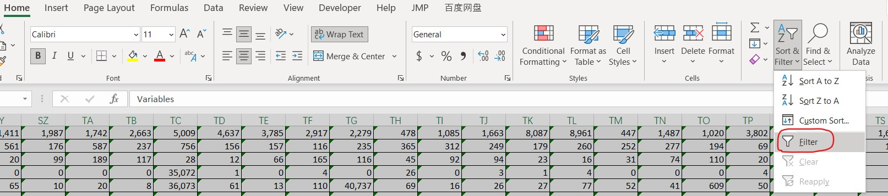{width=100%} <br> _Fig.3 Filter the data_
3      |Select the target ten trading partners for imports |Click on the triangle at the bottom right corner of cell A6, first uncheck "(Select All)", then check the 10 target countries/regions to filter them out <br> 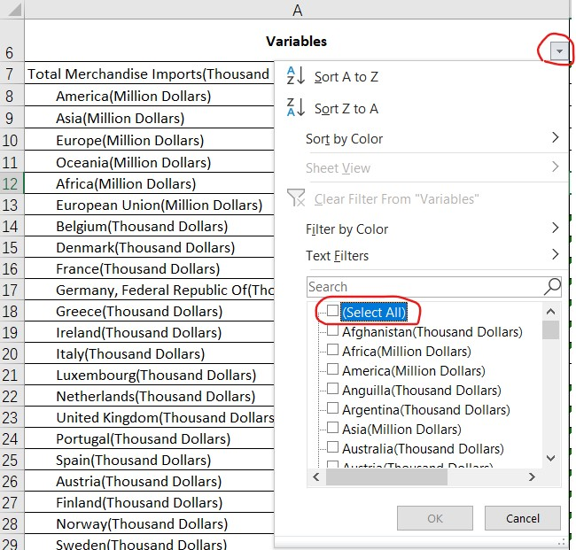{width=100%} <br> _Fig.4 Select target trading partners_
4      |Copy out the target countries/regions with import values |After filtering, select cells from A6 to A81, press Ctrl+C on Keyboard, and paste in the A1 cell in a new workbook by pressing Ctrl+V
5      |Select the import data between Jan 2011 to Dec 2020 |Select cells from PF6 to TU81, press Ctrl+C on Keyboard, and paste in the B1 cell in the same workbook as last step by pressing Ctrl+V, name this worksheet as "Import" <br> 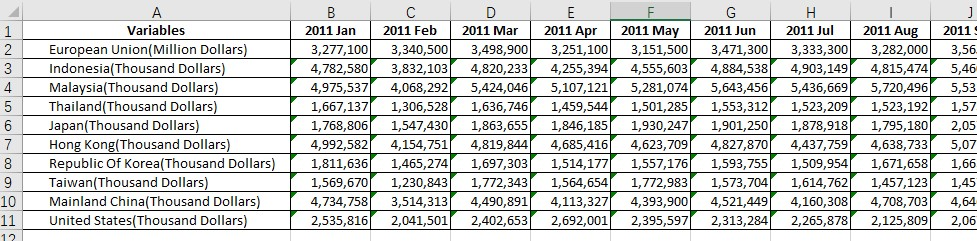{width=100%} <br> _Fig.5 The "Import" sheet after pasting_
6      |Prepare export sheet | Click on the + button next to "Import" sheet and name the new sheet as "Export" <br> 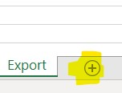 <br> _Fig.6_
7      |Filter the target ten trading partners for exports |Repeat step 2 and 3 for worksheet "T2" of "outputFile"
8      |Copy out the target countries/regions with export values |After filtering, select cells from A6 to A79, press Ctrl+C on Keyboard, and paste in the A1 cell in a "Export" sheet by pressing Ctrl+V
9      |Select the export data between Jan 2011 to Dec 2020 |Select cells from PF6 to TU79, press Ctrl+C on Keyboard, and paste in the B1 cell in the same sheet as last step by pressing Ctrl+V, save this workbook as "data_cleaned"
10     |Transform Million Dollars to Thousand Dollars for European Union import amount |In the "Import" sheet of "data_cleaned" workbook, type in 1000 in cell A20, copy A20 by pressing Ctrl+C, and select cells from B2 to DQ2, then click on Home pane -> Paste button -> Paste Special…, and select options as following screenshot in the pop up window. <br> 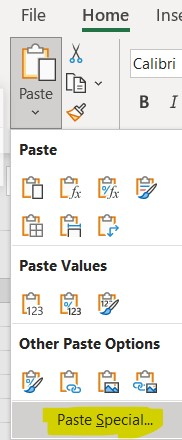{width=35%} 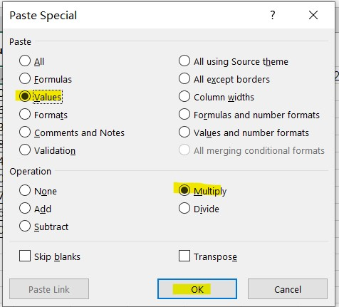{width=60%} <br> _Fig.7 Paste Special_
11     |Transform Thousand Dollars to Dollars for import amount |Copy A20 by pressing Ctrl+C, and select cells from B2 to DQ12, then click on Home pane -> Paste button -> Paste Special…, and select options as step 10. After done this step, clear cell A20
12     |Transform Million Dollars to Thousand Dollars for European Union export amount |Repeat step 10 for "Export" sheet
13     |Transform Thousand Dollars to Dollars for export amount|Repeat step 11 for "Export" sheet
14     |Open Tableau Prep Builder, and drag "data_cleaned" worksheet to the pane|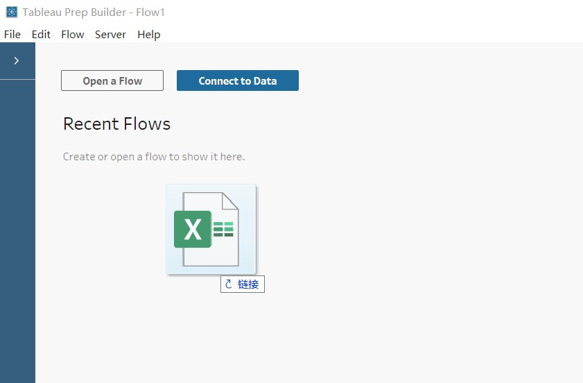{width=100%} <br> _Fig.8 Drag the data file to the pane of Tableau Prep Builder_
15     |In the opened window, drag "Export" sheet to the workflow pane| 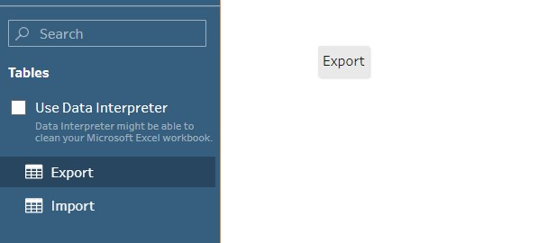{width=100%} <br> _Fig.9 Drag "Export" sheet to the pane_
16     |Click on "+" button next to "Export" sheet icon then click "Pivot"| 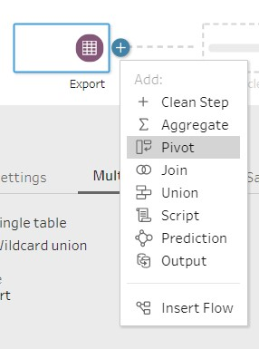 <br> _Fig.10_
17     |In the Settings pane below, select all fields with name consisting of "year month" and drag to the Pivoted Fields pane| 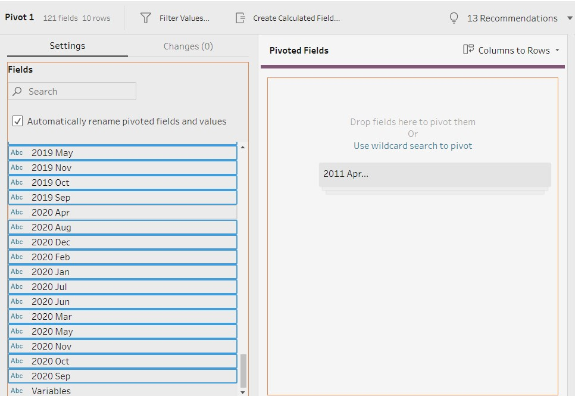{width=100%} <br> _Fig.11_
18     |In the Pivot Result Pane, click on the "Abc" sign on the up left corner of the 1st field, and select data type "Date", then do the same thing for the 2nd field and change the data type as "Number (Whole)"| 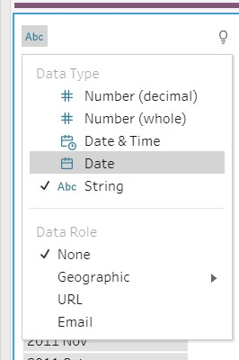{width=45%} 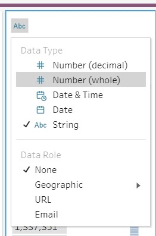{width=45%} <br> _Fig.12 Change the data type_
19     |Drag "Import" sheet to the workflow pane| Repeat step 17 and 18
20     |On the workflow pane above, click and hold on "Pivot 1" icon, then drag it to the "Join" area when the mouse hover over "Pivot 2" icon |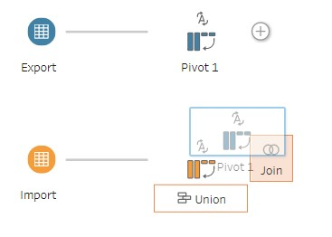{width=80%} <br> _Fig.13 Join the two sheet_
21     |Below the Settings pane, click the "+" button, set the applied join Clauses using Pivot1Name and Variables fields, and set join type as full by click the to circle as the right side screenshot shows |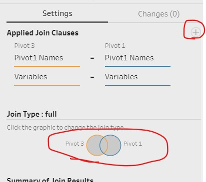{width=80%} <br> _Fig.14_
22     |In the Join Results pane, double click the name of the 2nd field and type in "Import", as the right side screenshot shows |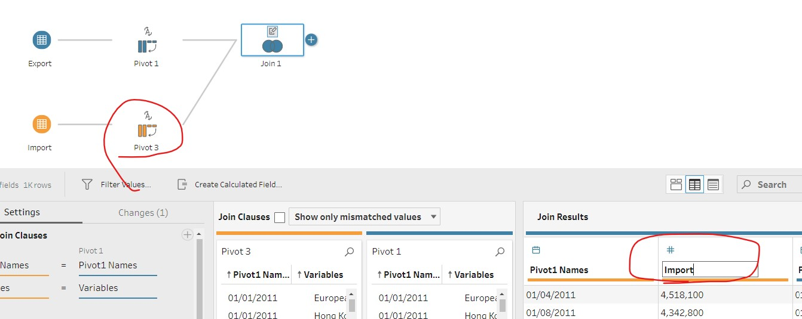{width=100%} <br> _Fig.15 Change the field name_
23     |As the right side screenshot shows, remove two fields by right click on the field and select "Remove"| 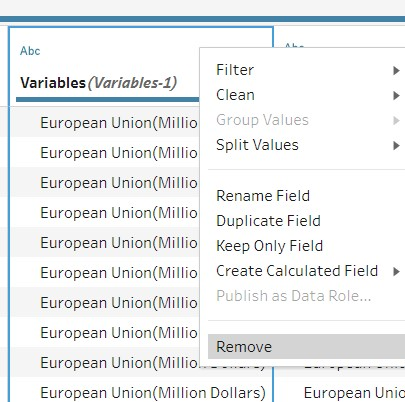{width=45%}  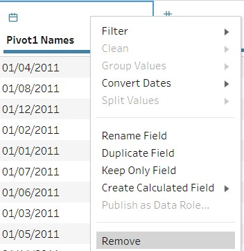{width=45%} <br> _Fig.16 Remove duplicate fields_
24     |Right click on the last field and select Split Values -> Automatic Split, then remove the last column as step 23|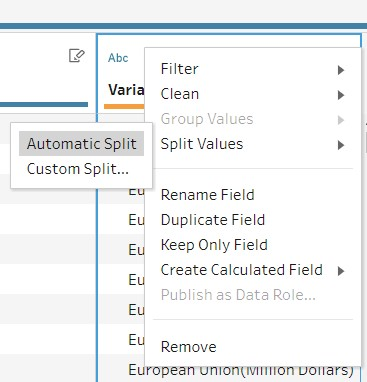{width=80%} <br> _Fig.17 Auto-split the last field_
25     |As step 22, change the 2st field name as "Date", and the 4th as "Export"| 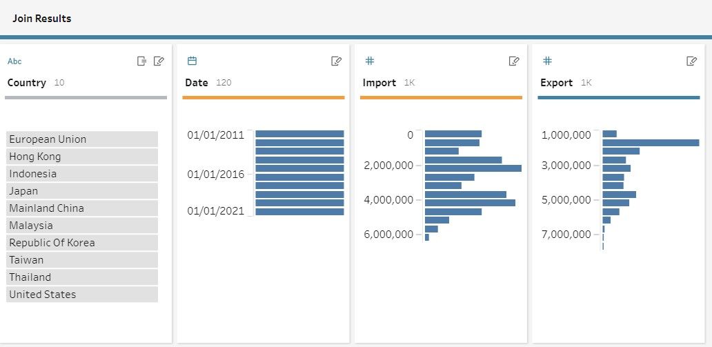{width=100%} <br> _Fig.18 The final result after revising field names_
26     |On the workflow pane, click the "+" button next to "Join 1" sign and select Output| 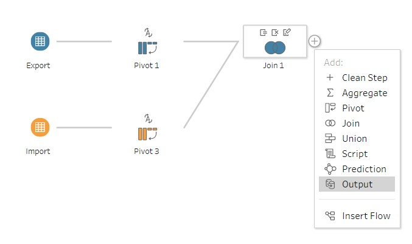{width=100%} <br> _Fig.19 Export the prepared data_
27     | Edit the output parameters on the output pane as the right side screenshot shows, click Run Flow button to save the prepared data file in csv format, named as "data_stacked.csv"| 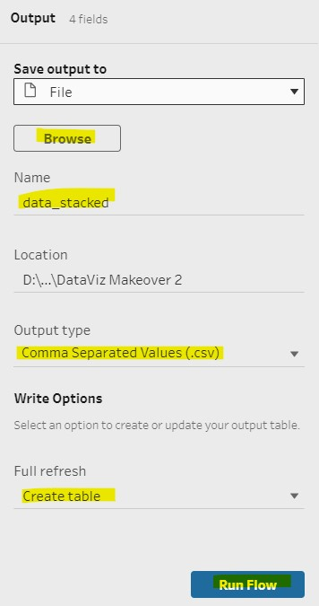{width=50%} <br> _Fig.20 Export the prepared data for visualization_


### 3.2 Data visualization steps

##### 3.2.1 Create bubble plot in Tableau

**NO.**|**Step**               |**Action**
-------|-----------------------|---------------------------------------------------------
1      |Launch Tableau Desktop, from the local directory where the "data_stacked.csv" is saved, drag and drop into the homepage as shown,keep default settings | 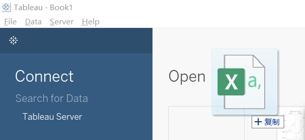{width=80%} <br> _Fig.21 Import data into Tableau_
2      |Click on Sheet 1, in Data pane, drag and drop `Export` to Columns, `Import` to Rows, `Country` to Detail box in Marks pane| 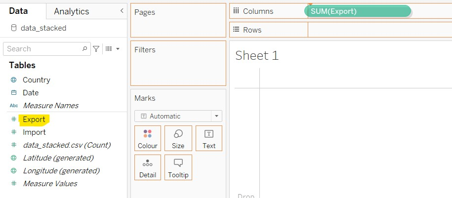{width=100%} 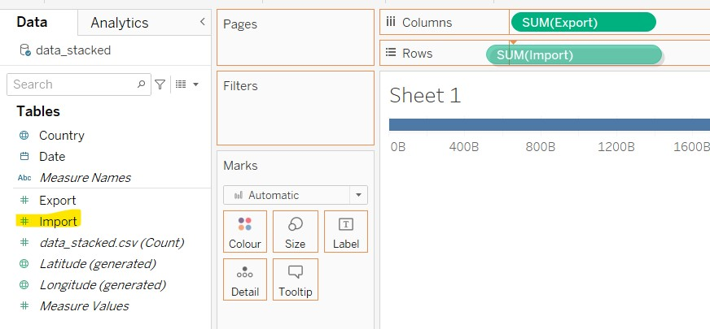{width=100%} 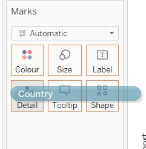{width=50%} <br> _Fig.22 Set the plot data_
3      |Click Analysis -> Create Calculated Field, in the pop out window, typing the name and formula as the right side screenshot shows, then click on OK| 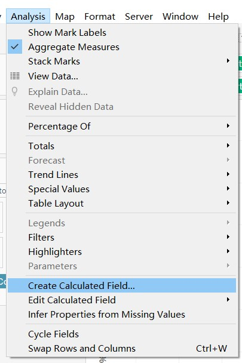{width=30%} 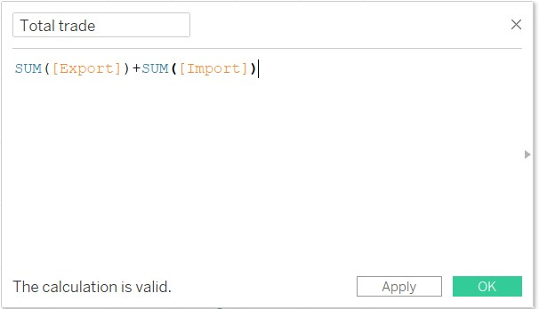{width=80%} <br> _Fig.23 Create the 1st calculation field_
4      |Repeat step3 to create other calculation fields need, the name and formula for each field is shown as the screenshots| 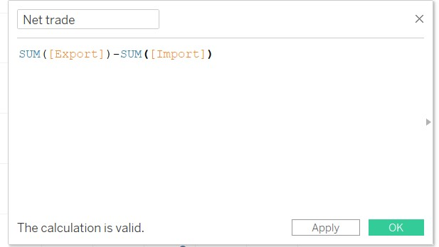{width=80%} 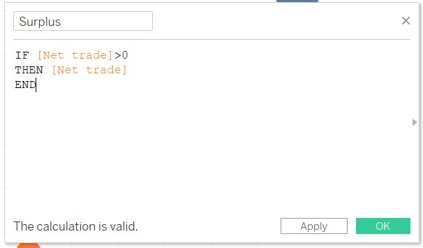{width=80%} 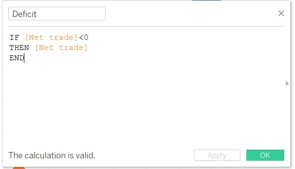{width=80%} 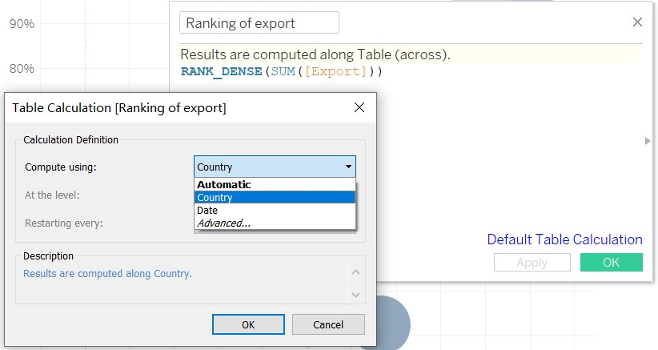{width=100%} 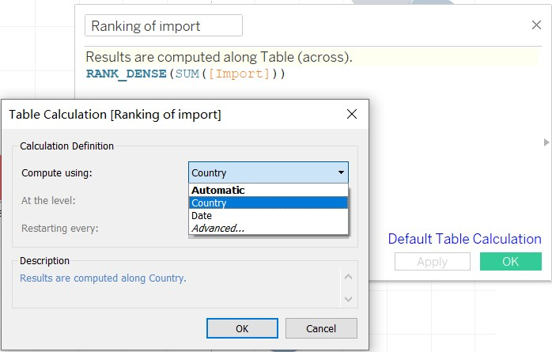{width=100%} 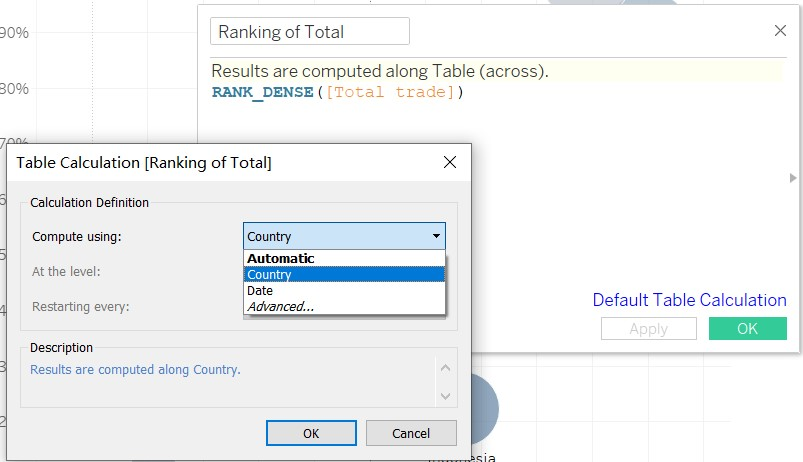{width=100%} <br> _Fig.24 Create the rest calculation fields_
5      |Drag and drop `Total Trade` on Size box and `Net trade` on Colour box, in Marks pane | 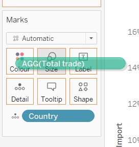{width=45%} 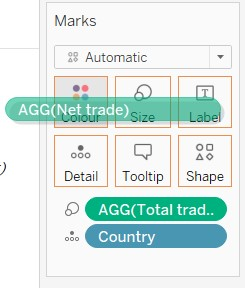{width=45%} <br> _Fig.25 Set the plot size and colour_
6      |Click on the "Automatic" drop list in Marks pane and select Circle, then drag and drop `Country` on Label box|  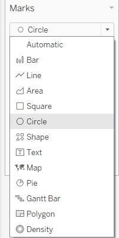{width=30%} 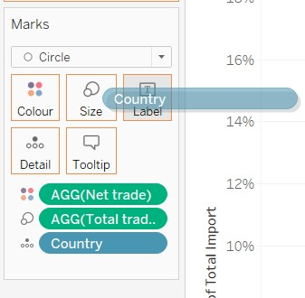{width=65%} <br> _Fig.26 Set the plot shape and label_
7      |Drag and drop `Date` in Filters pane and proceed as shown by screenshots| 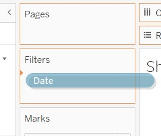{width=25%} 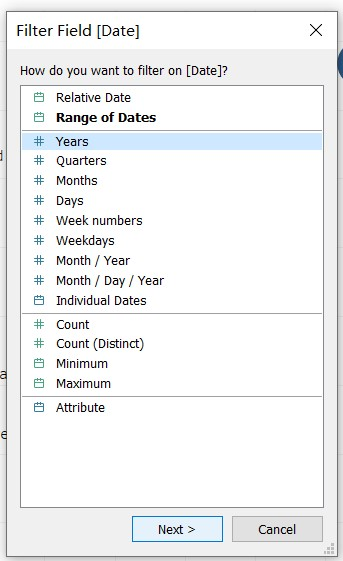{width=35%} 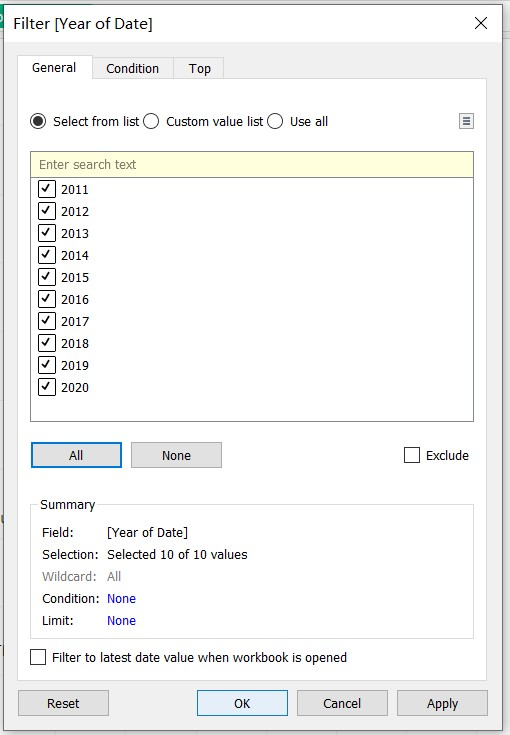{width=38%}<br> _Fig.27 Set the filter_
8      |Right click on `YEAR(Date)` in Filters pane and select Show Filter| 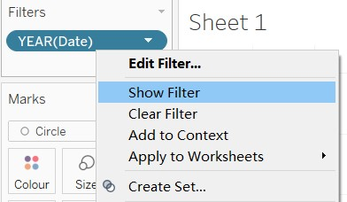{width=35%}  <br> _Fig.28 Show filter_
9      |Click the black triangle on the top right corner of filter, first select "Edit Tile...", and type in "Select a year" in the window popping up then click OK button| 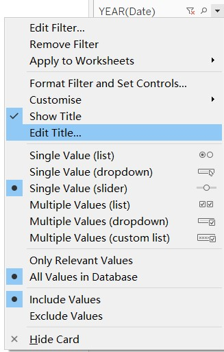{width=30%} 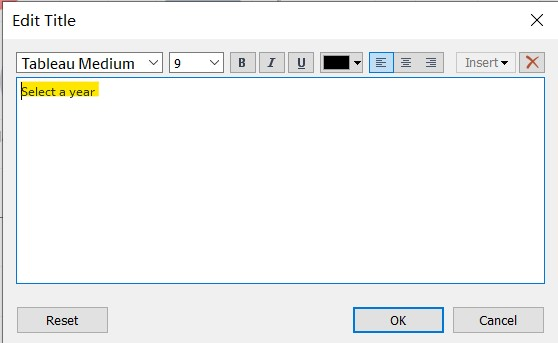{width=65%}<br> _Fig.29 Change the filter name_
10     |Repeat last step but  select "Single Value (list)"| 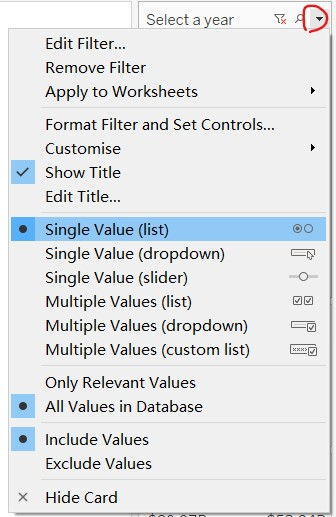{width=30%} <br> _Fig.30 Change the filter type_
11     |Double click on Color Legend on the right side and edit colours in the popping up window as screenshot shows| 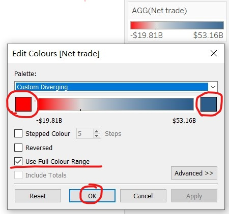{width=80%} <br> _Fig.31 Change the bubble plot colour scale_
12     |Click Colour box in Marks pane and change the opacity and border as the screenshot shows| 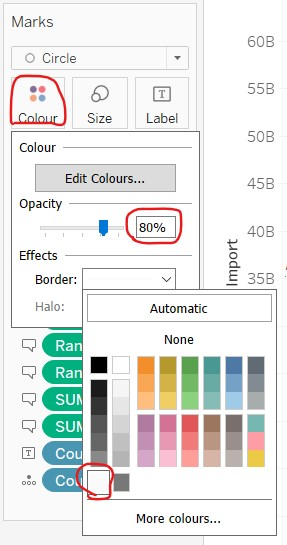{width=50%} <br> _Fig.32 Change the colour setting details_
13     |Click Size box in Marks pane and move the slider to the position as the screenshot shows| 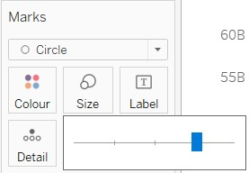 <br> _Fig.33 Change the bubble size_
14     |Click Format -> Animations and turn on animations| 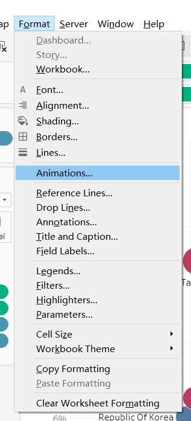{width=45%} 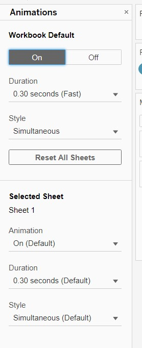{width=45%} <br> _Fig.34 Turn on animations_
15     |Press "Ctrl" key and click on `Deficit`, `Surplus`, `Ranking of export`, `Ranking of import`, `Ranking of Total`, `Export`, `Import`, drag and drop Tooltip box on Marks pane| 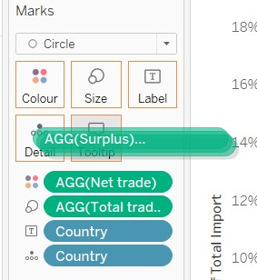{width=50%} <br> _Fig.35 Set tooltip_
16     |Click Format -> Font... -> Fields and select `AGG(Total trade)`, click Pane tab| 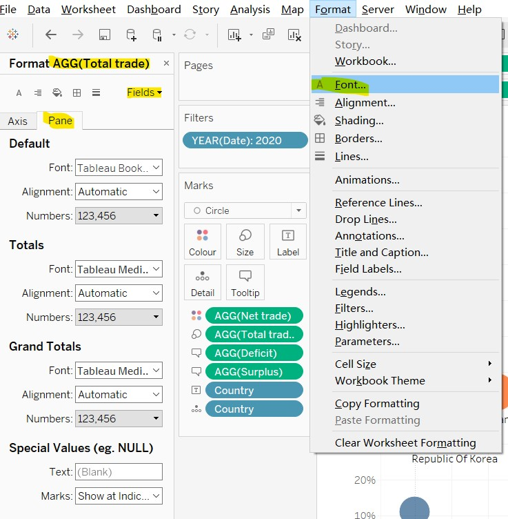{width=100%} <br> _Fig.36 Open format setting pane_
17     |Set the number format as right side screenshot shows| 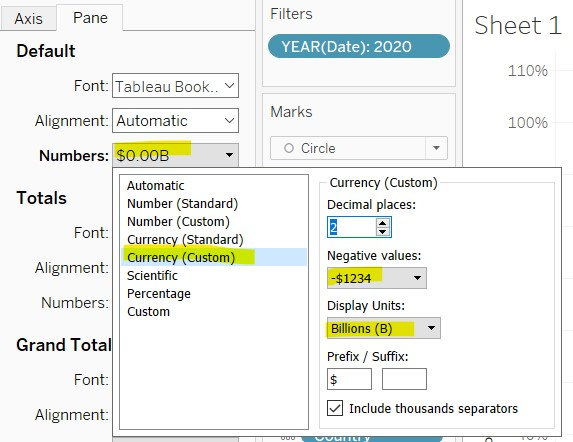{width=100%} <br> _Fig.37 Set number format for one field_
18     |Repeat step16 and select the fields one by one as shown in the screenshot, then repeat step17 to set the same format for these fields| {width=80%} <br> _Fig.38 Set number format for other fields_
19     |Right click on the "Import" axis and select Add Reference Line, and set the reference line in the window popping up, as the screenshot shows, then repeat this step for the "Export" axis| 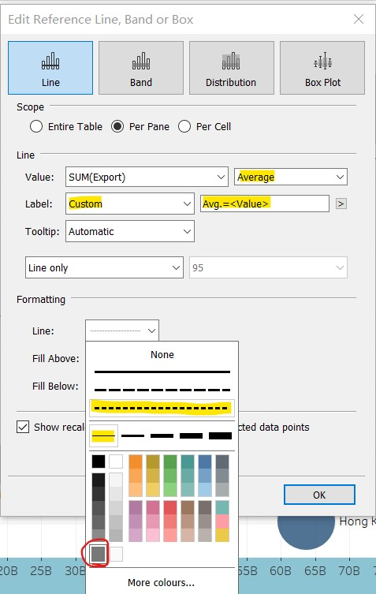{width=100%} <br> _Fig.39 Add reference line_

##### 3.2.2 Create bar chart in Tableau

**NO.**|**Step**               |**Action**
-------|-----------------------|---------------------------------------------------------
20     |Click "New worksheet" button to add Sheet 2| 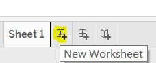 <br> _Fig.40 Add new worksheet for bar chart_
21     |In Sheet 2 -> Data pane, drag and drop `Net trade` to Columns, `Country` to Rows, `Net trade` to Colour box in Marks pane| 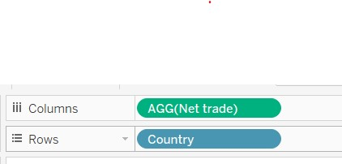{width=65%} 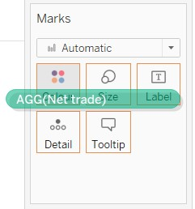{width=30%} <br> _Fig.41 Set plot fields and plot colour for the bar chart_
22     |Double click on the Colour Legend on the right side and edit Colours in the popping up window as screenshot shows| 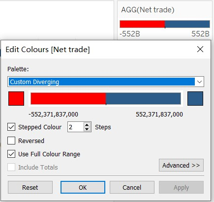{width=80%} <br> _Fig.42 Change the bar chart colour scale_
23     |Sort the sorting of `Country` by click the button shown in the screenshot| 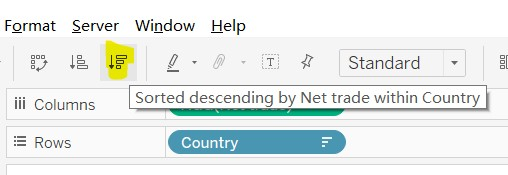{width=80%} <br> _Fig.43 Sort the countries/regions by descending order_
24     |Repeat step 7 and 8 for Sheet 2 to set filter
25     |Repeat step 16 and 17 for `Net trade` in Sheet 2 set the number format
26     |Repeat step 19 for "Net trade" axis to add reference line
27     |Double click "Net trade" axis and rename the axis as shown in the screenshot| 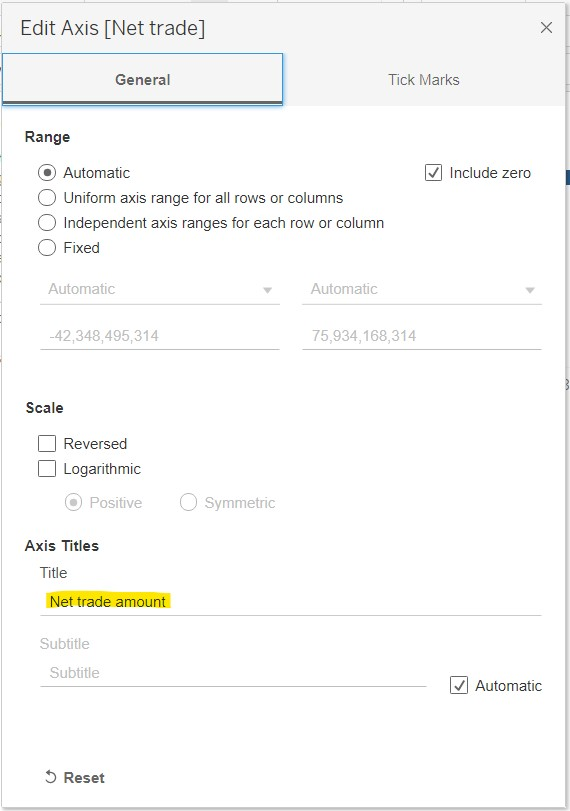{width=80%} <br> _Fig.44 Rename the "Net trade" axis_
28     |Drag and drop `Net trade` to Label box in Marks pane, then click Label box and click "Min/Max" as highlighted in the screenshot| 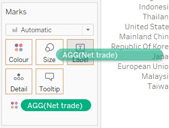{width=45%} {width=45%} <br> _Fig.45 Add the data label to the country/region with min and max net trade amount_


##### 3.2.3 Create line chart in Tableau

**NO.**|**Step**               |**Action**
-------|-----------------------|---------------------------------------------------------
29     |Repeat step 20 to add Sheet 3
30     |In Sheet 3 -> Data pane, drag and drop `Date` to Columns, `Export` to Rows, then drag and drop `Import` to the "Export" axis as shown in the screenshot| 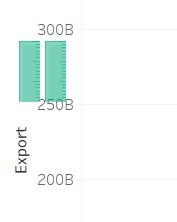 <br> _Fig.46 Set plot fields for the line chart_ 
31     |Right click `YEAR(Date)` and select continuous Year| 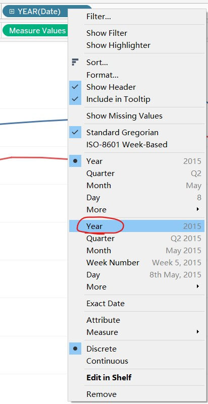{width=50%} <br> _Fig.47 Set YEAR as continuous format_
32     |Drag and drop `Measure Values` to the position as shown in the screenshot, to add the dual axis| 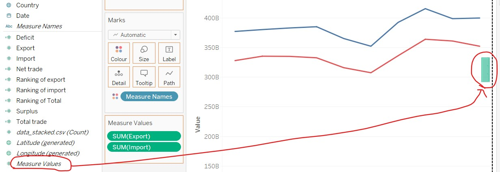{width=100%} <br> _Fig.48 Add the dual axis_
33     |Right click on the dual axis and check "Synchronise Axis", then right click again and uncheck "Show Header"| 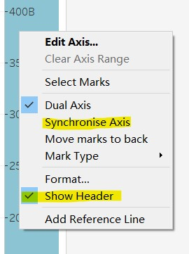{width=50%} <br> _Fig.49 Hide the dual axis_
34     |Click the second Measure Values tab in Marks pane, select "Circle" from the drop list of plot type| 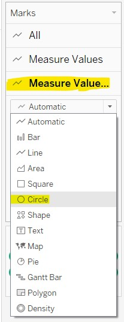{width=30%} <br> _Fig.50 Change the plot type_
35     |Click the first Measure Values tab in Marks pane, drag and drop `Measures Names` to the Label box in Marks pane| 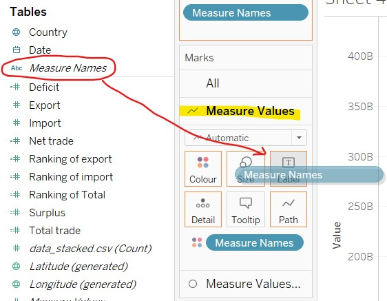{width=100%} <br> _Fig.51 Set the line label_
36     |Right click "Year of Date" axis and uncheck "Show Header"| 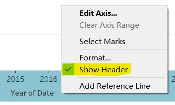{width=60%} <br> _Fig.52 Hide the header of X axis_
37     |Right click "Value" axis and select "Edit Axis", in the windows popping up, uncheck "Include zero" then close the window| 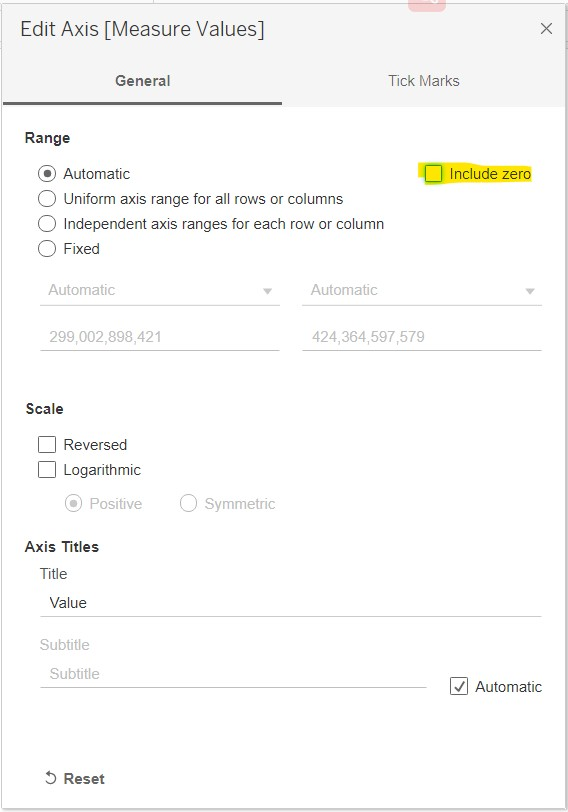{width=60%} <br> _Fig.53 Edit Y axis_
38     |Move the cursor to the bottom and right edge of plot area, when the cursor changes to the arrow shape, drag the cursor to adjust the size of plot area, as shown in the screenshot| 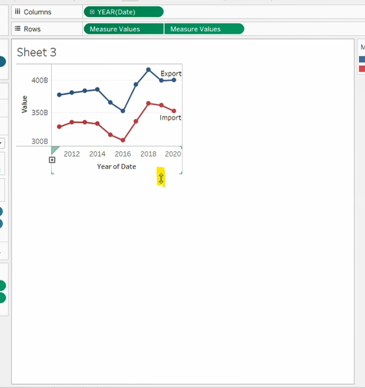{width=100%} <br> _Fig.54 Adjust the line chart size_
39     |Click Sheet 1, click Tooltip box on Marks pane. As the screenshot shows, type in texts, click "Insert" button, drag and drop fields and "Sheet 3" accordingly. Select all the text and set font size be 9, then set the font size of fields as 12 and the colour of fields as darker gray, except for setting `<SUM(Export)`, `<AGG(Ranking of export)>`, `<AGG(Surplus)>` be blue and `<SUM(Import)`, `<AGG(Ranking of import)>`, `<AGG(Deficit)>` be red| {width=100%} <br> _Fig.55 Revise verbiage and insert the line chart in tooltip of the bubble plot_

##### 3.2.4 Create dashboard in Tableau:
**NO.**|**Step**               |**Action**
-------|-----------------------|---------------------------------------------------------
40     |Click the New Dashboard button, then change the size of Dashboard as Generic Desktop (1366x768)| 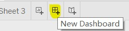 <br> _Fig.56 Add new dashboard_ <br> 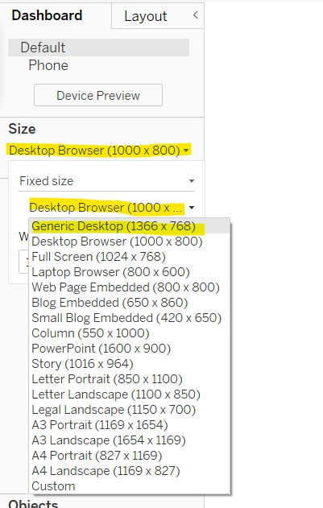{width=80%} <br> _Fig.57 Change the dashboard size_
41     |Drag and drop Sheet 1 to the Dashboard and then drag and drop Sheet 2 to the right side, move the cursor the the middle of the two sheets and when the cursor change to the arrow shape, click and drag the cursor to adjust the size of the two sheet, as shown in the screenshot| 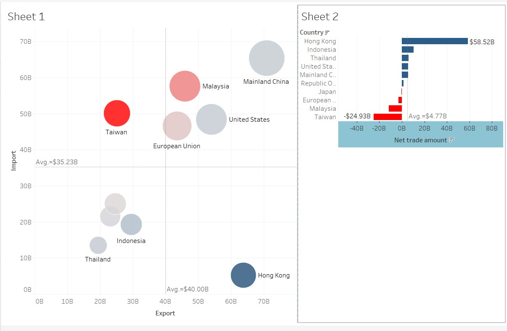{width=100%} <br> _Fig.58 Add sheets and adjust the size of the two sheet_
42     |Right click on "Sheet 1" title on the top and select "Hide Title", repeat this step for "Sheet 2" title| 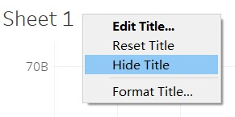 <br> _Fig.59 Hide the sheet titles_
43     |Right click on Color legend and click on "Edit Title", select all text and type in "Net trade in bubble plot" |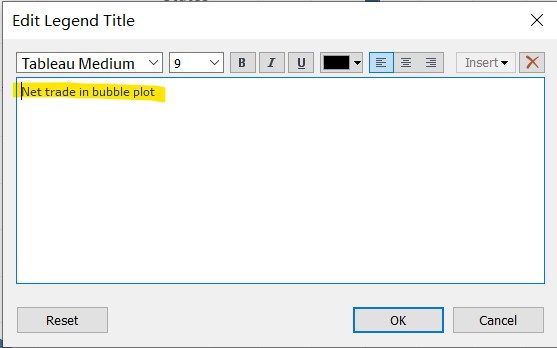{width=80%} <br> _Fig.60 Edit title of the colour legend_
44     | Click on the Legend as shown in the screenshot and click "x" to remove the legend from Dashboard1| 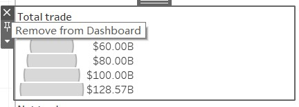{width=60%} <br> _Fig.61 Remove the legend_
45     |Right click the filter and select "Apply to Worksheets" -> "Selected Worksheets...", then check "Sheet 1" and "Sheet 2" and click OK| 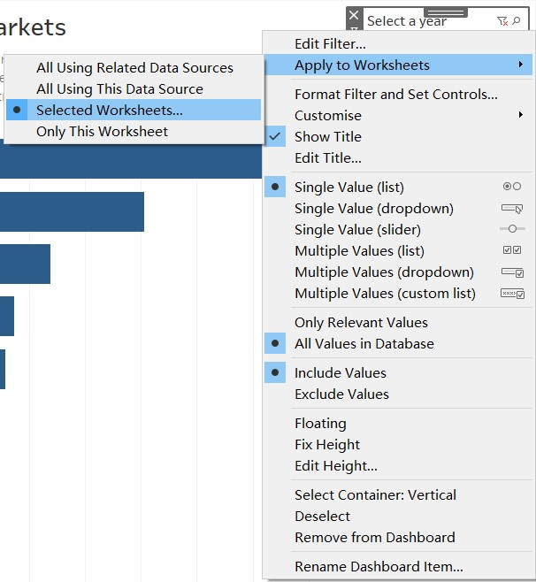{width=80%} 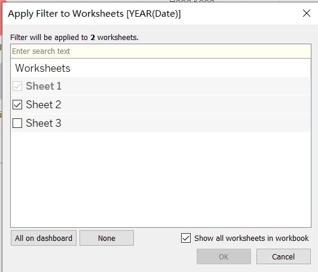{width=60%} <br> _Fig.62 Apply the filter to sheet 1 and sheet 2_
46     |From Objects pane, click on Text and drag to top of the plot area, and type in graph title as the right side screenshot shows. Set the font size as 16, bold and in black color| 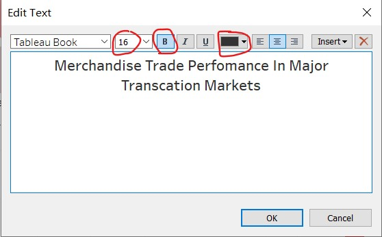{width=80%} <br> _Fig.63 Edit graph title_ 
47     |From Objects pane, click on Text and drag to area just below graph title, and type in lead-in verbiage as the right side screenshot shows. Keep the default font settings| {width=80%} <br> _Fig.64 Edit lead-in verbiage_
48     |From Objects pane, click on Text and drag to the bottom of plot area, and type in data source reference as the right side screenshot shows. Set the font size as 7| 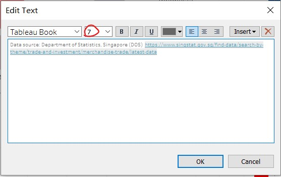{width=80%} <br> _Fig.65 Edit the data source reference_
49     |Drag the edge of the objects to adjust the size as shown in the screenshot, highlighted by yellow boxes | 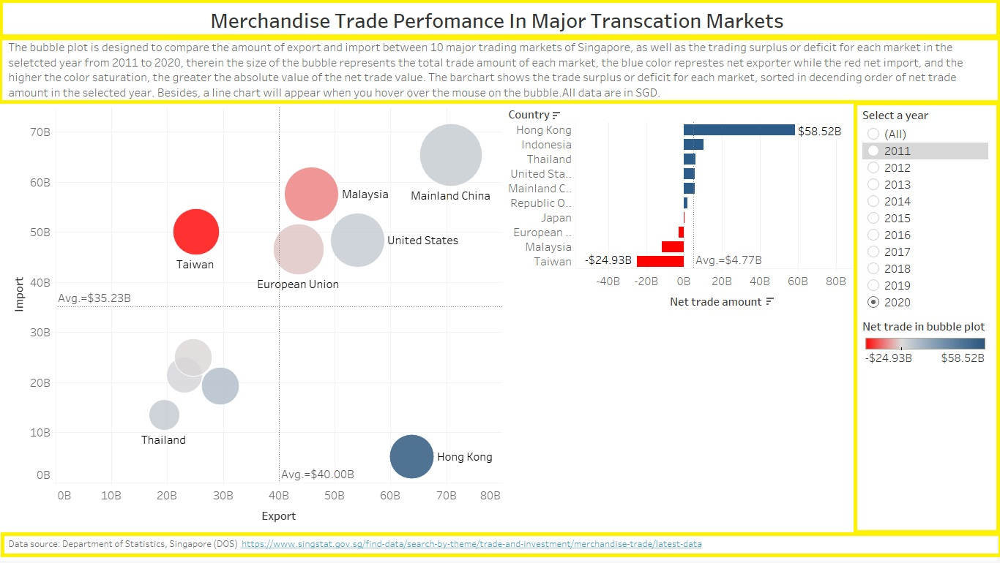{width=100%} <br> _Fig.66 Change the size of objects in Dashboard1_
50     |From Objects pane, click on Text and drag to the bottom-right corner of plot area, and type in note content the right side screenshot shows. Set the font size as 7| 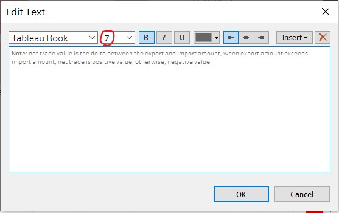{width=80%} <br> _Fig.67 Add a note_
51     |Repeat step 38 to adjust the size of bar chart in Dashboard 1, as shown in the screenshot| 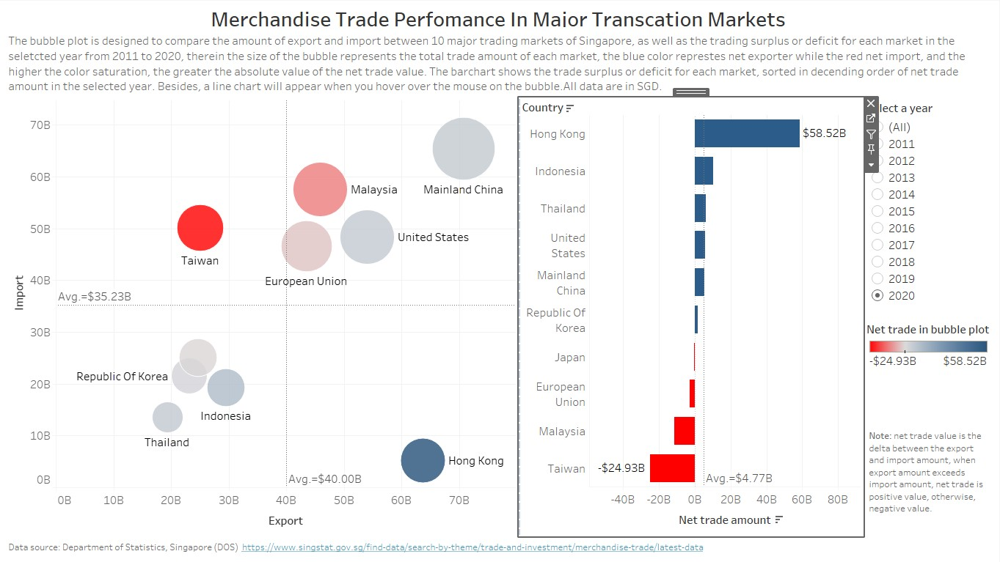{width=100%} <br> _Fig.68 Adjust the size of bar chart_


# 4. Final Visualization

The final visualization proposed is displayed as below:

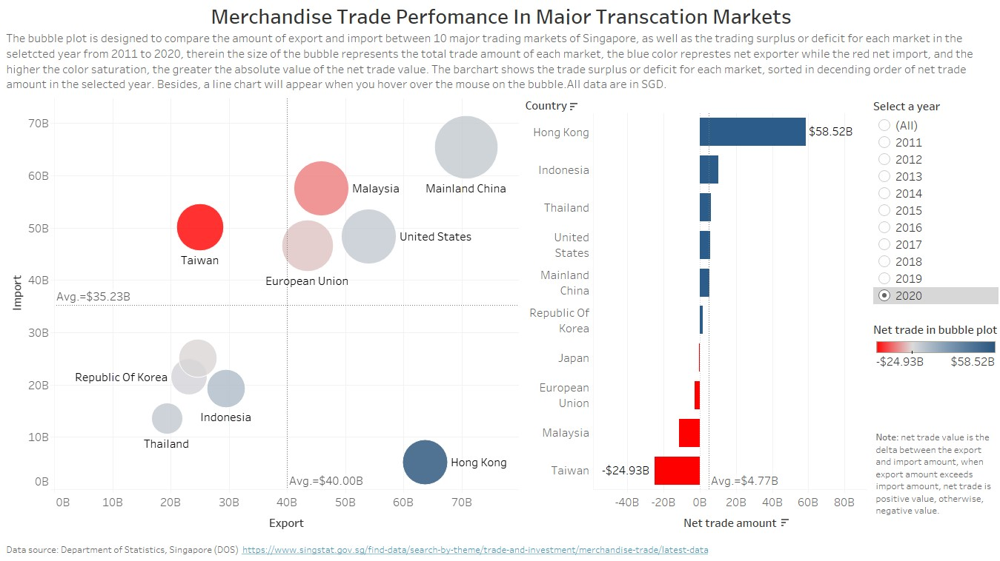 <br> _Fig.69 Snapshot of final dashboard - Bubble plot and Bar chart_

The sorting of major trade partners in bar chart will change in descending order of net trade value automatically when select a year, so can clearly compare the net trade amount between trade partners in the specific year.

When hovering over cursor on the bubble, the tooltip with line chart will pop up, which indicates how export and import trade amount in the selected market change along time.

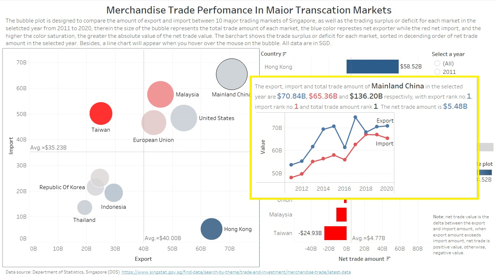 <br> _Fig.70 Snapshot of final dashboard - Line chart_

Full visualization is available at [**Tableau Public**](https://public.tableau.com/app/profile/dong.fang.regina/viz/DataVizMakeover2_16239465641540/Dashboard1).


# 5. Major Observations

Below list observations for this visualization and related interpretations:

**Insight 1:** From the view of 10 years in total, Hong Kong had the highest net export trade amount, while Taiwan holding the highest net import trade amount.

Although Hong Kong and Taiwan has the highest net export and import trade amount respectively, they don't have much higher total trading amount seeing the bubble size. 

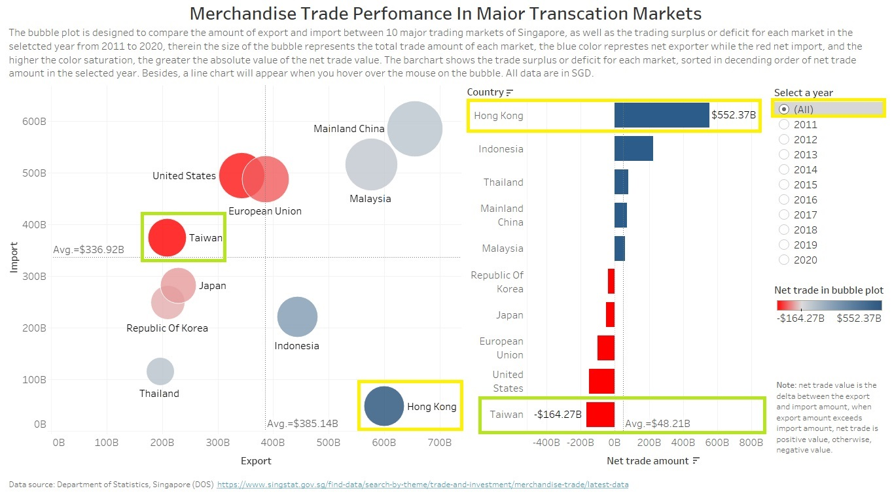 
_Fig.71 Snapshot of ten year total trading performance_ <br>

And if see the specific export and import trade amount, we can find Hong Kong has the lowest ranking of import, and quite high ranking of export, and the trade amount is quite stable with in the ten years. On the other hand, Taiwan has relatively low ranking of export.

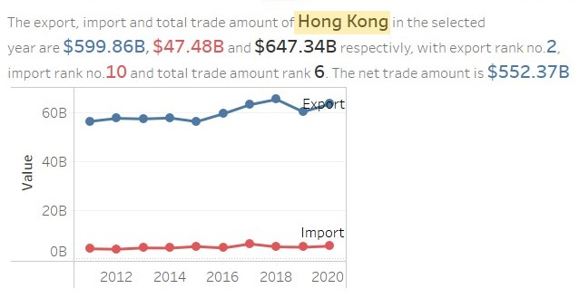{width=46%}  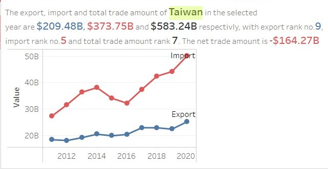{width=46%}
_Fig.72 The changing trend of export and import trade amount of Hong Kong and Taiwan

**Insight 2:** 


