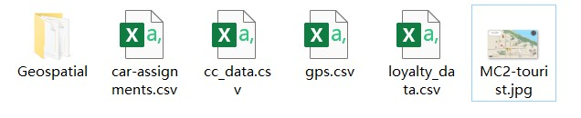

```{r setup, include=FALSE}
options(htmltools.dir.version = FALSE)
knitr::opts_chunk$set(fig.retina = 3,   # To make the figure looks sharper, set the retina value >=3, default is 1 
                      echo = TRUE,      # Show code chunk
                      eval = TRUE,      # Run the code
                      message = FALSE,  # Don't show error massage
                      warning = FALSE)  # Don't show warning massage
```

# 1. Background

## 1.1 Case overview

GAStech is a Tethys-based company having been operating a natural gas production site in the island country of Kronos for over 20 years. It has produced remarkable profits and developed strong relationships with the government of Kronos, but has not been as successful in demonstrating environmental stewardship.

In January, 2014, the leaders of GAStech are celebrating their new-found fortune as a result of the initial public offering of their very successful company. In the midst of this celebration, several employees of GAStech go missing. An organization known as the Protectors of Kronos (POK) is suspected in the disappearance, but things may not be what they seem.

This case is designed aim at helping the law enforcement from Kronos and Tethys investigate the incident by using data visualization techniques. There are 3 challenges in [**VAST Challenge 2021**](https://vast-challenge.github.io/2021/index.html) focusing on different aspects of case analysis. In this report we concentrated on visualization and analysis for Mini-Challenge 2.

## 1.2 Requirement for Mini-Challenge 2

Many of the Abila, Kronos-based employees of GAStech have company cars which are approved for both personal and business use. Those who do not have company cars have the ability to check out company trucks for business use, but these trucks cannot be used for personal business. The vehicles are installed with GPS tracked periodically as long as they are moving. Besides, in order to promote local businesses, Kronos based companies provide a Kronos Kares benefit card to GASTech employees giving them discounts and rewards in exchange for collecting information about their credit card purchases and preferences as recorded on loyalty cards. 

Now the vehicle tracking data for the two weeks prior to the incident, car assignment list, transaction records in credit card and loyal card are available for analyzing.

The challenges to be dealt with are listed below:

**No.**| **Question**
-------|------------------------------------------------------------------------------------------------------------
1      |Using just the credit and loyalty card data, identify the most popular locations, and when they are popular. What anomalies do you see? What corrections would you recommend to correct these anomalies?
2      |Add the vehicle data to your analysis of the credit and loyalty card data. How does your assessment of the anomalies in question 1 change based on this new data? What discrepancies between vehicle, credit, and loyalty card data do you find?
3      |Can you infer the owners of each credit card and loyalty card? What is your evidence? Where are there uncertainties in your method? Where are there uncertainties in the data?
4      |Given the data sources provided, identify potential informal or unofficial relationships among GASTech personnel. Provide evidence for these relationships. 
5      |Do you see evidence of suspicious activity? Identify 1- 10 locations where you believe the suspicious activity is occurring, and why.

The detailed information and all the data needed for Mini-challenge 2 is available in [VAST Challenge 2021 official website](https://vast-challenge.github.io/2021/MC2.html).

# 2. Data Preparation

## 2.1 Data description

The dataset used for Mini-Challenge 2 includes 4 CSV files, a package of ESRI shapefiles of Abila and Kronos, and a tourist map of Abila in JPEG format, as shown in the following screenshot.

{width=80%} <br> <p style="text-align:center;"> _Fig.1 Dataset for visualization and analysis_ </p>

The data contents in the CSV files are listed below:

**File**  | **Description**               | **Data Content**
----------|-------------------------------|------------------------------------------------------
car-assignments.csv | A list of vehicle assignments by employee | Employee Last Name <br>	Employee First Name <br> Car ID <br> Current Employment Type (Department) <br>	Current Employment Title (job title)
gps.csv | vehicle tracking data | Timestamp <br> Car ID (integer) <br> Latitude <br> Longitude
cc_data.csv | credit and debit card transaction data | Timestamp <br>	Location (name of the business) <br> Price (real) <br> Last 4 digits of the credit or debit card number
loyalty_data.csv | loyalty card transaction data | Timestamp <br>	Location (name of the business) <br>	Price (real) <br>	Loyalty Number (A 5-character code starting with L that is unique for each card)

## 2.2 Steps for data preparation

### 2.2.1 Installing and launching R Packages 

We used R studio as the tool to import, process, visualize and analyze the data. 

The first thing is run this line of code to clear the environment and remove existing R objects (if any).

```{r}
rm(list=ls())
```

The code chunk below is used to install and launch the packages necessary for next steps.

```{r}
packages = c('ggiraph', 'plotly','DT', 'patchwork', 
             'raster', 'sf','tmap', 'mapview','gifski',
             'tidyverse', 'mlr','lubridate')
for (p in packages){
  if(!require(p, character.only = T)){
    install.packages(p)
  }
  library(p, character.only = T)
}
```

### 2.2.2 Importing relevent data

First of all we import the CSV file using below code chunk.

```{r}
car_ass <- read_csv("data/car-assignments.csv")
gps <- read_csv("data/gps.csv")
cc <- read_csv("data/cc_data.csv", locale = locale(encoding = "windows-1252"))
loyalty <- read_csv("data/loyalty_data.csv", locale = locale(encoding = "windows-1252"))
```

### 2.2.3 Wrangling the data

As shown below, we need to check if the data type is proper in the imported tibble data table. It's obvious that the *Timestamp* in gps.csv, cc_data.csv and loyalty_data.csv should be in datetime format but now it's in character format. Besides, *CarID* in car-assignments.csv, *id* in gps.csv and *last4ccnum* in cc_data.csv should be converted from numerical data to categorical data.

* car-assignments.csv

```{r echo=FALSE}
glimpse(car_ass)
```

* gps.csv

```{r echo=FALSE}
glimpse(gps)
```

* cc_data.csv

```{r echo=FALSE}
glimpse(cc)
```

* loyalty_data.csv

```{r echo=FALSE}
glimpse(loyalty)
```

We use below code chunk to covert data types.

```{r}
gps$Timestamp = mdy_hms(gps$Timestamp)
cc$timestamp = mdy_hm(cc$timestamp)
loyalty$timestamp = mdy(loyalty$timestamp)

car_ass$CarID = as.character(car_ass$CarID)
gps$id = as.character(gps$id)
cc$last4ccnum = as.character(cc$last4ccnum)
```

Since the transaction date in credit and loyalty card data are all in January, the date of month, weekday, hour of time can be derived from *timestamp* and displayed in different columns of cc_data.csv and loyalty_data.csv. The same as GPS tracking data. As shown in below code chunk, `day()` function is used to get the date, `wday()` to get the weekday, `hour()` to get the hour of time.

```{r}
cc$day = day(cc$timestamp)
cc$weekday = wday(cc$timestamp, label = T, abbr = T)
cc$hour = hour(cc$timestamp)
loyalty$day = day(loyalty$timestamp)
loyalty$weekday = wday(loyalty$timestamp, label = T, abbr = T)
gps$day = as.factor(day(gps$Timestamp))
gps$weekday = wday(gps$Timestamp, label = T, abbr = T)
gps$hour = as.factor(hour(gps$Timestamp))
```

### 2.2.4 Exploring and cleaning data

Then we do some exploration for the data and check the missing values by using the code chunks below. Only *CarID* in car-assignments.csv has 9 missing values.

```{r}
knitr::kable(summarizeColumns(car_ass), caption = "EDA for Car Assigment Data", digits = 2)
```

```{r}
knitr::kable(summarizeColumns(gps), caption = "EDA for GPS Tracking Data", digits = 2)
```

```{r}
knitr::kable(summarizeColumns(cc), caption = "EDA for Credit Card Transaction Data", digits = 2)
```

```{r}
knitr::kable(summarizeColumns(loyalty), caption = "EDA for Loyalty Card Transaction Data", digits = 2)
```

The records containing missing values in car-assignment.csv are shown below. We can see these records are all company trucks not for personal use.

```{r echo=FALSE}
car_ass_na <- filter(car_ass, is.na(CarID))
knitr::kable(car_ass_na, format = "html", caption = "The Missing Values in Car Assignment Dataset")
```


# 3. Data Visualization

## 3.1 Histogram showing frequecy of transactions

First of all, a 2d histogram for credit card transaction frequency with *location* by *hour* was built by below code chunk. A slider was added to select range of days as the filtering criterion.

```{r}
d <- highlight_key(cc)

# Plot the 2d histogram for credit card
gra_1 <- plot_ly(data = d, x = ~as.factor(hour), y = ~location,
                 hovertemplate = paste(
                   " %{yaxis.title.text}: %{y}<br>",
                   "%{xaxis.title.text}: %{x}<br>",
                   "Transaction Count: %{z}",
                   "<extra></extra>")) %>%
  add_histogram2d(colors = "Blues") %>%
  layout(title = "<b>Graph.1 Credit Card Transcation Frequency by Hour</b>",
         xaxis = list(title = "Time", tickmode = "linear"),
         yaxis = list(title="Location", tickmode = "linear")
         )

# dd a slider to the graph to select the range of date
crosstalk::bscols(gra_1,
                  crosstalk::filter_slider("day", "Date of Jan", 
                                           d, ~day, step = 1, 
                                           animate = T, ticks = F), 
                  widths = 10)
```

Then the 2d histograms for credit card and loyalty card transaction frequency with *location* by *day* were created as below. Added a dropdown list to select the card number as filtering criteria to show the transaction frequency of specific card owner along days.

```{r}
d1 = highlight_key(cc)
d2 = highlight_key(loyalty)

# Plot the 2d histogram of credit card transaction frequency
gra_2.1 <- plot_ly(data = d1, x = ~as.factor(day), y = ~location,
                 hovertemplate = paste(
                   " %{yaxis.title.text}: %{y}<br>",
                   "%{xaxis.title.text}: %{x}<br>",
                   "Transaction Count: %{z}",
                   "<extra></extra>")) %>%
  add_histogram2d(colors = "Blues") %>%
  layout(title = "<b>Graph.2-1 Credit Card Transaction Frequency by Day</b>",
         #annotations = list(text = "Credit Card", showarrow = F, x =10, y=32),
         xaxis = list(title = "Date of Jan", tickmode = "linear"),
         yaxis = list(title = "Location", tickmode = "linear")
         )

# Plot the 2d histogram of loyalty card transaction frequency
gra_2.2 <- plot_ly(data = d2, x = ~as.factor(day), y = ~location,
                 hovertemplate = paste(
                   " Location: %{y}<br>",
                   "Date of Jan: %{x}<br>",
                   "Transaction Count: %{z}",
                   "<extra></extra>")) %>%
  add_histogram2d(colors = "Greys") %>%
  layout(title = "<b>Graph.2-2 Loyalty Card Transaction Frequency by Day</b>",
         #annotations = list(text = "Loyalty Card", showarrow = F, x =10, y=32),
         xaxis = list(title = "Date of Jan", tickmode = "linear"),
         yaxis = list(title = "Location", tickmode = "linear", visible = T)
         )

# Add a dropdown list to the graph to filter the card number
gra_2.1_c <- crosstalk::bscols(gra_2.1,
                               crosstalk::filter_select(
                                 "ccnum", 
                                 "Choose last 4 credit card Number",
                                 d1, ~last4ccnum,
                                 multiple = T),
                               widths = 10)
gra_2.2_c <- crosstalk::bscols(gra_2.2,
                               crosstalk::filter_select(
                                 "lonum", 
                                 "Choose loyalty card number",
                                 d2, ~loyaltynum,
                                 multiple = T),
                               widths = 10)

gra_2.1_c
gra_2.2_c
```

## 3.2 Geographical graph showing movement path

Now take the GPS tracking data into account, it's necessary to draw movement path on the tourist map with the GPS tracking data, so that we can see where the employees have gone and gathered together during the two weeks before the disappearance.

The first thing to do is plotting Raster Layer of the tourist map of Abila, Kronos, as the background map, and import Abila GIS data layer.

```{r}
bgmap <- raster("data/MC2-tourist.jpg")
bgmap
Abila_st <- st_read(dsn = "data/Geospatial", layer = "Abila")
```

According to the result of bgmap, the extent of bound is (0, 2740, 0, 1535) for (xmin, xmax, ymin, ymax), while the bounding box of Abila_st is (24.82401, 24.90997, 36.04502, 36.09492) for (xmin, xmax, ymin, ymax). So it's necessary to reset the coordinate bounding of bgmap according to Abila_st, or the GPS tracks won't be matched and shown on the background map normally. Below code chunk is for setting the extreme coordinates of bgmap.

```{r}
xmin(bgmap) = 24.82401
xmax(bgmap) = 24.90997
ymin(bgmap) = 36.04502
ymax(bgmap) = 36.09492
```

The code chunk below is used to convert GPS spatial data into a Simple Feature (SF) data frame.

```{r}
gps_sf <- st_as_sf(gps, 
                   coords = c("long", "lat"),
                   crs = 4326)
```

Then before combining the background map and the GPS tracking lines to generate the movement path, the spatial data need to be grouped by *id*, *day* and *hour* respectively.

```{r}
# Group by id and day
gps_path <- gps_sf %>%
  group_by(id, day) %>%
  summarize(m = mean(Timestamp), 
            do_union=FALSE) %>%
  st_cast("LINESTRING")

np = npts(gps_path, by_feature = T)
gps_path2 <- cbind(gps_path, np) %>%
  filter(np > 1) # exclude orphan coordinate records

# Group by id and hour
gps_hour <- gps_sf %>%
  group_by(id, hour) %>%
  summarise(m = mean(Timestamp),
            do_union = FALSE) %>%
  st_cast("LINESTRING")
```

Set *day* as filtering criteria by using `filter()` function, and differentiate the line colors by *id* through setting `col` argument of `tm_lines()` function, so that the geographical graph could show the movement track of all cars in specific date. Below code chunk is used to create the graph. 

```{r}
# Filter GPS spatial data by date of Jan
gps_path_selected <- gps_path2 %>%
  filter(day=="6") 

# Plot the moving path
tmap_mode("view")
gra_3 <- tm_shape(bgmap) +
  tm_rgb(bgmap, r = 1,g = 2,b = 3,
       alpha = NA,
       saturation = 1,
       interpolate = TRUE,
       max.value = 255) +
  tm_shape(gps_path_selected) +
  tm_lines(col =  "id", palette = "Dark2") +
  tmap_options(max.categories = 44) 

gra_3
```
<p style="text-align:center;"> _Graph.3 GPS Moving Route in A Specific Day_ </p>

Set *hour* as filtering criteria  by using `filter()` function, and differentiate the line colors by *id* through setting `col` argument of `tm_lines()` function, so that the geographical graph could show the movement track of all cars in specific hour of days. Below code chunk is used to create the graph.

```{r}
# Filter GPS spatial data by hour of time
gps_hour_selected <- gps_hour %>%
  filter(hour=="7")

# Plot the moving path
tmap_mode("view")
gra_4 <- tm_shape(bgmap) +
  tm_rgb(bgmap, r = 1,g = 2,b = 3,
       alpha = NA,
       saturation = 1,
       interpolate = TRUE,
       max.value = 255) +
  tm_shape(gps_hour_selected) +
  tm_lines(col = "id", palette = "Dark2") +
  tmap_options(max.categories = 44)

gra_4
```
<p style="text-align:center;"> _Graph.4 GPS Moving Route of in A Specific Hour_ </p>


## 3.3 Line chart showing average price

In order to compare the money spent in different locations, a line chart showing average price spent in credit card and loyal card in weekdays and weekends were created by below code chunk.

In the code chunk, first calculate the average price grouped by *weekday* and *location* using `group_by()` and `summarize()` function, then combine them in one table with `rbind()` function, which is used to plot the line chart using functions of `plotly` packages. A dropdown list is added to select the location to be filtered.

```{r}
# Calculate the average price by weekday and location, then combine the results
mean_price <- cc %>%
  group_by(weekday, location) %>%
  summarize(Avg.Price = mean(price)) %>%
  ungroup() %>%
  mutate(card = "Credit Card") %>%
  rbind(
    loyalty %>%
      group_by(weekday, location) %>%
      summarize(Avg.Price = mean(price)) %>%
      ungroup() %>%
      mutate(card = "Loyalty Card")
  )

# Plot the line chart
d <- highlight_key(mean_price)
gra_5 <- plot_ly(data = d, x = ~weekday, y= ~Avg.Price, 
                 color = ~card, colors = "Paired", 
                 linetype = ~card,
                 type = 'scatter', mode = 'lines+markers') %>%
  layout(title = "<b>Graph.5 Average Transaction Price by Weekday</b>")

# Add a dropdown list to select one location
crosstalk::bscols(crosstalk::filter_select("loc", "Choose a location first",
                                           d, ~location, multiple = F),
                  gra_5,
                  widths = 10)
```

## 3.4 Box plot for all transaction price

As the line chart above can't vividly show the comparison of transaction price between locations nor the outliers among them, a box plot is created by below code chunk, where the first step is to combine *cc* and *loyalty* dataset as the plotting data source, then using `plot_ly()` function to generate the graph. A dropdown list is added to select the weekday to be filtered.

```{r fig.width=22}
# Combine cc and loyalty data
cards <- cc %>%
  select(-hour) %>%
  rename(cardnum = last4ccnum) %>%
  mutate(card = "Credit Card") %>%
  rbind(loyalty %>%
    rename(cardnum = loyaltynum) %>%
      mutate(card = "Loyalty Card"))

# Generate the box plot
d <- highlight_key(cards)
gra_6 <- plot_ly(data = d,x = ~location, y= ~price, 
                 color = ~card, colors = "Paired",
                 type = 'box') %>%
  layout(title = "<b>Graph.6 Box Plot of Transaction Price by Location</b>",
         boxmode = "group")

# Add a dropdown list to filter the weekday
crosstalk::bscols(gra_6,
                  crosstalk::filter_select("wdy", "Choose the weekday",
                                             d, ~weekday, multiple = T),
                  widths = 22)
```

# 4. Data Analysis and Insights 


# 5. Conclusion


# Backups


```{r eval=FALSE}
#bgmap <- raster("data/Geospatial/MC2-tourist.tif")
bgmap <- raster("data/MC2-tourist.jpg")
#res(bgmap) <- c(3.16216e-05, 3.16216e-05)
#crs(bgmap) <- "+proj=longlat +datum=WGS84"
xmin(bgmap) = 24.82419
xmax(bgmap) = 24.90976
ymin(bgmap) = 36.04499
ymax(bgmap) = 36.09543

bgmap
#Abila_st <- st_read(dsn = "data/Geospatial", layer = "Abila")
#Abila_st
```

```{r eval=FALSE}
#gra_2 <- subplot(gra_2.1, gra_2.2, nrows = 1, shareY = T) %>%
#  layout(title = "<b>Graph.2 Transaction Frequency by Day</b>",
#         xaxis = list(title = "Date of Jan"),
#         xaxis2 = list(title = "Date of Jan"),
#         yaxis = list(title = "Location"),
#         autosize = F, width = 800, width2 = 800, height = 400
#         )
```

tm_layout(title = "Graph.3 GPS Moving Route in A Specific Day")

tm_layout(title = "Graph.4 GPS Moving Route of in A Specific Hour")

```{r eval=FALSE}
bg_jpg <- image_read("data/MC2-tourist.jpg")
bg_tif <- image_convert(bg_jpg, "tif")
image_info(bg_tif)
image_info(bg_jpg)
image_write(bg_tif, "data/MC2-tourist.tif")
```

```{r eval=FALSE}
# Backup
gps_c <- dplyr::select(gps, lat, long)
segment = traclus(gps_c, 36, 5)
```


```{r eval=FALSE}
# Calculate the average price by weekday and location
cc_mean <- cc %>%
  group_by(weekday, location) %>%
  summarize(Avg.Price = mean(price)) %>%
  ungroup() %>%
  mutate(card = "Credit Card")

loy_mean <- loyalty %>%
  group_by(weekday, location) %>%
  summarize(Avg.Price = mean(price)) %>%
  ungroup() %>%
  mutate(card = "Loyalty Card")

# Combine the data table
mean_price <- rbind(cc_mean, loy_mean)

# Plot the line chart
d <- highlight_key(mean_price)
gra_5 <- plot_ly(data = d, x = ~weekday, y= ~Avg.Price, 
                 color = ~card, colors = "Paired", 
                 linetype = ~card,
                 type = 'scatter', mode = 'lines+markers') %>%
  layout(title = "<b>Graph.5 Average Transaction Price by Weekday</b>")

# Add a dropdown list to select one location
crosstalk::bscols(crosstalk::filter_select("loc", "Choose a location first",
                                           d, ~location, multiple = F),
                  gra_5,
                  widths = 10)
```

```{r eval=FALSE}
cc_mean <- cc %>%
  group_by(weekday, location) %>%
  summarize(Avg.Price = mean(price)) %>%
  ungroup() %>%
  mutate(card = "Credit Card")

loy_mean <- loyalty %>%
  group_by(weekday, location) %>%
  summarize(Avg.Price = mean(price)) %>%
  ungroup() %>%
  mutate(card = "Loyalty Card")

mean_price <- rbind(cc_mean, loy_mean)

gra_5.1 <- mean_price %>%
  ggplot(aes(weekday, Avg.Price, colour = card)) +
  geom_line() +
  geom_point(size = 1) +
  labs(title = "<b>Graph.5 Average Transaction Price by Weekday</b>") +
  facet_wrap(~location, ncol = 4, scales = "free_y") +
  theme_light() + 
  #scale_color_brewer(palette = "Dark2") +
  scale_y_continuous(name = "Average Price")

gra_5.1 <- ggplotly(gra_5.1) %>%
  layout(autosize = F, width = 1000, height = 2000)

gra_5.1
```

```{r fig.width=22, eval=FALSE}
# Combine cc and loyalty data
cards <- cc %>%
  select(-hour) %>%
  rename(cardnum = last4ccnum) %>%
  mutate(card = "Credit Card") %>%
  rbind(loyalty %>%
    rename(cardnum = loyaltynum) %>%
      mutate(card = "Loyalty Card"))

# Generate the box plot
d <- highlight_key(cards)
gra_6 <- plot_ly(data = d,x = ~location, y= ~price, 
                 color = ~card, colors = "Dark2",
                 type = 'box') %>%
  layout(title = "<b>Graph.6 Box Plot of Transaction Price by Location</b>",
         boxmode = "group")

# Add a dropdown list to filter the weekday
crosstalk::bscols(gra_6,
                  crosstalk::filter_select("wdy", "Choose the weekday",
                                             d, ~weekday, multiple = T),
                  widths = 22)
```


