```{r setup, include=FALSE}
options(htmltools.dir.version = FALSE)
knitr::opts_chunk$set(fig.retina = 3,   # To make the figure looks sharper, set the retina value >=3, default is 1 
                      echo = TRUE,      # Show code chunk
                      eval = TRUE,      # Run the code
                      message = FALSE,  # Don't show error massage
                      warning = FALSE)  # Don't show warning massage
```

# 1. Background

## 1.1 Case overview

GAStech is a Tethys-based company having been operating a natural gas production site in the island country of Kronos for over 20 years. It has produced remarkable profits and developed strong relationships with the government of Kronos, but has not been as successful in demonstrating environmental stewardship.

In January, 2014, the leaders of GAStech are celebrating their new-found fortune as a result of the initial public offering of their very successful company. In the midst of this celebration, several employees of GAStech go missing. An organization known as the Protectors of Kronos (POK) is suspected in the disappearance, but things may not be what they seem.

This case is designed aim at helping the law enforcement from Kronos and Tethys investigate the incident by using data visualization techniques. There are 3 challenges in [**VAST Challenge 2021**](https://vast-challenge.github.io/2021/index.html) focusing on different aspects of case analysis. In this report we concentrated on visualization and analysis for Mini-Challenge 2.

## 1.2 Requirement for Mini-Challenge 2

Many of the Abila, Kronos-based employees of GAStech have company cars which are approved for both personal and business use. Those who do not have company cars have the ability to check out company trucks for business use, but these trucks cannot be used for personal business. The vehicles are installed with GPS tracked periodically as long as they are moving. Besides, in order to promote local businesses, Kronos based companies provide a Kronos Kares benefit card to GASTech employees giving them discounts and rewards in exchange for collecting information about their credit card purchases and preferences as recorded on loyalty cards. 

Now the vehicle tracking data for the two weeks prior to the incident, car assignment list, transaction records in credit card and loyal card are available for analyzing.

The challenges to be dealt with are listed below:

**No.**| **Question**
-------|------------------------------------------------------------------------------------------------------------
1      |Using just the credit and loyalty card data, identify the most popular locations, and when they are popular. What anomalies do you see? What corrections would you recommend to correct these anomalies?
2      |Add the vehicle data to your analysis of the credit and loyalty card data. How does your assessment of the anomalies in question 1 change based on this new data? What discrepancies between vehicle, credit, and loyalty card data do you find?
3      |Can you infer the owners of each credit card and loyalty card? What is your evidence? Where are there uncertainties in your method? Where are there uncertainties in the data?
4      |Given the data sources provided, identify potential informal or unofficial relationships among GASTech personnel. Provide evidence for these relationships. 
5      |Do you see evidence of suspicious activity? Identify 1- 10 locations where you believe the suspicious activity is occurring, and why.

The detailed information and all the data needed for Mini-challenge 2 is available in [VAST Challenge 2021 official website](https://vast-challenge.github.io/2021/MC2.html).


# 2. Data Preparation

## 2.1 Data description

The dataset used for Mini-Challenge 2 includes 4 CSV files, a package of ESRI shapefiles of Abila and Kronos, and a tourist map of Abila in JPEG format, as shown in the following screenshot.

{width=80%} <br> <p style="text-align:center;"> _Fig.1 Dataset for visualization and analysis_ </p>

The data contents in the CSV files are listed below:

**File**  | **Description**               | **Data Content**
----------|-------------------------------|------------------------------------------------------
car-assignments.csv | A list of vehicle assignments by employee | Employee Last Name <br>	Employee First Name <br> Car ID <br> Current Employment Type (Department) <br>	Current Employment Title (job title)
gps.csv | vehicle tracking data | Timestamp <br> Car ID (integer) <br> Latitude <br> Longitude
cc_data.csv | credit and debit card transaction data | Timestamp <br>	Location (name of the business) <br> Price (real) <br> Last 4 digits of the credit or debit card number
loyalty_data.csv | loyalty card transaction data | Timestamp <br>	Location (name of the business) <br>	Price (real) <br>	Loyalty Number (A 5-character code starting with L that is unique for each card)

## 2.2 Steps for data preparation

### 2.2.1 Installing and launching R Packages 

We used R studio as the tool to import, process, visualize and analyze the data. 

The first thing is run this line of code to clear the environment and remove existing R objects (if any).

```{r}
rm(list=ls())
```

The code chunk below is used to install and launch the packages necessary for next steps.

```{r}
packages = c('ggiraph', 'plotly','DT', 'patchwork', 
             'raster', 'sf','tmap', 'mapview','gifski',
             'tidyverse', 'mlr','lubridate')
for (p in packages){
  if(!require(p, character.only = T)){
    install.packages(p)
  }
  library(p, character.only = T)
}
```

### 2.2.2 Importing relevent data

First of all, below code chunk is used to identify the encoding type of the CSV file to make sure no garbled characters in the imported data.

```{r}
guess_encoding("data/car-assignments.csv")
guess_encoding("data/gps.csv")
guess_encoding("data/cc_data.csv")
guess_encoding("data/loyalty_data.csv")
```

According to above results, "windows-1254" would be set as the encoding for cc_data.csv and loyalty_data.csv when importing the file, using `read_csv()` function in `tidyverse` package.

```{r}
car_ass <- read_csv("data/car-assignments.csv")
gps <- read_csv("data/gps.csv")
cc <- read_csv("data/cc_data.csv", locale = locale(encoding = "windows-1252"))
loyalty <- read_csv("data/loyalty_data.csv", locale = locale(encoding = "windows-1252"))
```

### 2.2.3 Converting data types

As shown below, we need to check if the data type is proper in the imported tibble data table. It's obvious that the *Timestamp* in gps.csv, cc_data.csv and loyalty_data.csv should be in datetime format but now it's in character format. Besides, *CarID* in car-assignments.csv, *id* in gps.csv and *last4ccnum* in cc_data.csv should be converted from numerical data to categorical data.

* car-assignments.csv

```{r echo=FALSE}
glimpse(car_ass)
```

* gps.csv

```{r echo=FALSE}
glimpse(gps)
```

* cc_data.csv

```{r echo=FALSE}
glimpse(cc)
```

* loyalty_data.csv

```{r echo=FALSE}
glimpse(loyalty)
```

To achieve this, `mdy_hms()` and `mdy()` functions in `lubridate` package are used to covert the data type to datetime, and `as.character()` function is used to convert data as characters.

```{r}
gps$Timestamp = mdy_hms(gps$Timestamp)
cc$timestamp = mdy_hm(cc$timestamp)
loyalty$timestamp = mdy(loyalty$timestamp)

car_ass$CarID = as.character(car_ass$CarID)
gps$id = as.character(gps$id)
cc$last4ccnum = as.character(cc$last4ccnum)
```

Since the transaction date in credit and loyalty card data are all in January, the date of month, weekday, hour of time can be derived from *timestamp* and displayed in different columns of cc_data.csv and loyalty_data.csv. The same as GPS tracking data. As shown in below code chunk, `day()` function is used to get the date, `wday()` to get the weekday, `hour()` to get the hour of time.

```{r}
cc$day = day(cc$timestamp)
cc$weekday = wday(cc$timestamp, label = T, abbr = T)
cc$hour = hour(cc$timestamp)
loyalty$day = day(loyalty$timestamp)
loyalty$weekday = wday(loyalty$timestamp, label = T, abbr = T)
gps$day = as.factor(day(gps$Timestamp))
gps$weekday = wday(gps$Timestamp, label = T, abbr = T)
gps$hour = as.factor(hour(gps$Timestamp))
```

### 2.2.4 Exploring and cleaning data

Then we do some exploration for the data and check the missing values by using the code chunks below. Only *CarID* in car-assignments.csv has 9 missing values.

```{r}
knitr::kable(summarizeColumns(car_ass), caption = "EDA for Car Assigment Data", digits = 2)
```

```{r}
knitr::kable(summarizeColumns(gps), caption = "EDA for GPS Tracking Data", digits = 2)
```

```{r}
knitr::kable(summarizeColumns(cc), caption = "EDA for Credit Card Transaction Data", digits = 2)
```

```{r}
knitr::kable(summarizeColumns(loyalty), caption = "EDA for Loyalty Card Transaction Data", digits = 2)
```

The records containing missing values in car-assignment.csv are shown below. We can see these records are all company trucks not for personal use. As the number of missing values are not large and the missed fileds not quite important, no need to clean or exclude these records.

```{r echo=FALSE}
car_ass_na <- filter(car_ass, is.na(CarID))
knitr::kable(car_ass_na, format = "html", caption = "The Missing Values in Car Assignment Dataset")
```


# 3. Data Visualization

## 3.1 Histogram showing frequecy of transactions

First of all, a 2d histogram for credit card transaction frequency with *location* by *hour* was built by below code chunk. A slider is added to select range of days as the filtering criterion, and a data table is linked to the graph to show details related to the selections.

```{r}
d <- highlight_key(cc)

# Plot the 2d histogram for credit card
gra_1 <- plot_ly(data = d, x = ~as.factor(hour), y = ~location,
                 hovertemplate = paste(
                   " %{yaxis.title.text}: %{y}<br>",
                   "%{xaxis.title.text}: %{x}<br>",
                   "Transaction Count: %{z}",
                   "<extra></extra>")) %>%
  add_histogram2d(colors = "Blues") %>%
  layout(title = "<b>Graph.1 Credit Card Transcation Frequency by Hour</b>",
         xaxis = list(title = "Time", tickmode = "linear"),
         yaxis = list(title="Location", tickmode = "linear")
         )

# Add a slider to the graph to select the range of date, and
#  link a data table to show details
crosstalk::bscols(
                  crosstalk::filter_slider("day", "Date of Jan", 
                                           d, ~day, step = 1, 
                                           animate = T, ticks = F),
                  gra_1,
                  DT::datatable(d, filter=c("top"), class = "hover",
                                options = list(pageLength = 5,
                                               columnDefs = list(
                                                 list(visible = FALSE,
                                                      targets = c(5, 7)))
                                               )),
                  widths = 10)
```

Then the 2d histograms for credit card and loyalty card transaction frequency with *location* by *day* were created as below. Added a dropdown list to select the card number as filtering criteria to show the transaction frequency of specific card owner along days.

```{r}
d1 = highlight_key(cc)
d2 = highlight_key(loyalty)

# Plot the 2d histogram of credit card transaction frequency
gra_2.1 <- plot_ly(data = d1, x = ~as.factor(day), y = ~location,
                 hovertemplate = paste(
                   " %{yaxis.title.text}: %{y}<br>",
                   "%{xaxis.title.text}: %{x}<br>",
                   "Transaction Count: %{z}",
                   "<extra></extra>")) %>%
  add_histogram2d(colors = "Blues") %>%
  layout(title = "<b>Graph.2-1 Credit Card Transaction Frequency by Day</b>",
         #annotations = list(text = "Credit Card", showarrow = F, x =10, y=32),
         xaxis = list(title = "Date of Jan", tickmode = "linear"),
         yaxis = list(title = "Location", tickmode = "linear")
         )

# Plot the 2d histogram of loyalty card transaction frequency
gra_2.2 <- plot_ly(data = d2, x = ~as.factor(day), y = ~location,
                 hovertemplate = paste(
                   " Location: %{y}<br>",
                   "Date of Jan: %{x}<br>",
                   "Transaction Count: %{z}",
                   "<extra></extra>")) %>%
  add_histogram2d(colors = "Greys") %>%
  layout(title = "<b>Graph.2-2 Loyalty Card Transaction Frequency by Day</b>",
         #annotations = list(text = "Loyalty Card", showarrow = F, x =10, y=32),
         xaxis = list(title = "Date of Jan", tickmode = "linear"),
         yaxis = list(title = "Location", tickmode = "linear", visible = T)
         )

# Add a dropdown list to the graph to filter the card number
gra_2.1_c <- crosstalk::bscols(crosstalk::filter_select(
                                 "ccnum", 
                                 "Choose last 4 credit card Number",
                                 d1, ~last4ccnum,
                                 multiple = F),
                               gra_2.1,
                               widths = 10)
gra_2.2_c <- crosstalk::bscols(crosstalk::filter_select(
                                 "lonum", 
                                 "Choose loyalty card number",
                                 d2, ~loyaltynum,
                                 multiple = F),
                               gra_2.2,
                               widths = 10)

gra_2.1_c
gra_2.2_c
```

## 3.2 Geographical graph showing movement path

Now take the GPS tracking data into account, it's necessary to draw movement path on the tourist map with the GPS tracking data, so that we can see where the employees have gone and gathered together during the two weeks before the disappearance.

The first thing to do is plotting Raster Layer of the tourist map of Abila, Kronos, as the background map, and import Abila GIS data layer.

```{r}
bgmap <- raster("data/MC2-tourist.jpg")
bgmap
Abila_st <- st_read(dsn = "data/Geospatial", layer = "Abila")
```

According to the result of bgmap, the extent of bound is (0, 2740, 0, 1535) for (xmin, xmax, ymin, ymax), while the bounding box of Abila_st is (24.82401, 24.90997, 36.04502, 36.09492) for (xmin, xmax, ymin, ymax). So it's necessary to reset the coordinate bounding of bgmap according to Abila_st, or the GPS tracks won't be matched and shown on the background map normally. Below code chunk is for setting the extreme coordinates of bgmap.

```{r}
xmin(bgmap) = 24.82401
xmax(bgmap) = 24.90997
ymin(bgmap) = 36.04502
ymax(bgmap) = 36.09492
```

The code chunk below is used to convert GPS spatial data into a Simple Feature (SF) data frame.

```{r}
gps_sf <- st_as_sf(gps, 
                   coords = c("long", "lat"),
                   crs = 4326)
```

Then before combining the background map and the GPS tracking lines to generate the movement path, the spatial data need to be grouped by *id*, *day* and *hour* respectively.

```{r}
# Group by id and day
gps_path <- gps_sf %>%
  group_by(id, day) %>%
  summarize(m = mean(Timestamp), 
            do_union=FALSE) %>%
  st_cast("LINESTRING")

np = npts(gps_path, by_feature = T)
gps_path2 <- cbind(gps_path, np) %>%
  filter(np > 1) # exclude orphan coordinate records

# Group by id and hour
gps_hour <- gps_sf %>%
  group_by(id, hour) %>%
  summarise(m = mean(Timestamp),
            do_union = FALSE) %>%
  st_cast("LINESTRING")

np = npts(gps_hour, by_feature = T)
gps_hour2 <- cbind(gps_hour, np) %>%
  filter(np > 1) # exclude orphan coordinate records
```

Set *day* as filtering criteria by using `filter()` function, and differentiate the line colors by *id* through setting `col` argument of `tm_lines()` function, so that the geographical graph could show the movement track of all cars in specific date. Below code chunk is used to create the graph. 

```{r}
# Filter GPS spatial data by date of Jan
gps_path_selected <- gps_path2 %>%
  filter(day == "16") 

# Plot the moving path
tmap_mode("view")
gra_3.1 <- tm_shape(bgmap) +
  tm_rgb(bgmap, r = 1,g = 2,b = 3,
       alpha = NA,
       saturation = 1,
       interpolate = TRUE,
       max.value = 255) +
  tm_shape(gps_path_selected) +
  tm_lines(col =  "id", palette = "Dark2") +
  tmap_options(max.categories = 44) 

gra_3.1
```
<p style="text-align:center;"> _Graph.3-1 GPS Moving Route in A Specific Day_ </p>

Set *id* as filtering criteria by using `filter()` function, and differentiate the line colors by *day* through setting `col` argument of `tm_lines()` function, so that the geographical graph could show the movement track of a specific car in all days. Below code chunk is used to create the graph. 

```{r}
# Filter GPS spatial data by CarID
gps_path_selected2 <- gps_path2 %>%
  filter(id == "1") 

# Plot the moving path
tmap_mode("view")
gra_3.2 <- tm_shape(bgmap) +
  tm_rgb(bgmap, r = 1,g = 2,b = 3,
       alpha = NA,
       saturation = 1,
       interpolate = TRUE,
       max.value = 255) +
  tm_shape(gps_path_selected2) +
  tm_lines(col =  "day", palette = "Dark2")

gra_3.2
```
<p style="text-align:center;"> _Graph.3-2 GPS Moving Route of A Specific CarID_ </p>

Set *hour* as filtering criteria  by using `filter()` function, and differentiate the line colors by *id* through setting `col` argument of `tm_lines()` function, so that the geographical graph could show the movement track of all cars in specific hours of days. Below code chunk is used to create the graph.

```{r}
# Filter GPS spatial data by hours of time
gps_hour_selected <- gps_hour2 %>%
  filter(hour %in% c(23, 0, 1, 2))

# Plot the moving path
tmap_mode("view")
gra_4 <- tm_shape(bgmap) +
  tm_rgb(bgmap, r = 1,g = 2,b = 3,
       alpha = NA,
       saturation = 1,
       interpolate = TRUE,
       max.value = 255) +
  tm_shape(gps_hour_selected) +
  tm_lines(col = "id", palette = "Dark2") +
  tmap_options(max.categories = 44)

gra_4
```
<p style="text-align:center;"> _Graph.4 GPS Moving Route of in Specific Hours_ </p>


## 3.3 Line chart of average price by weekday

In order to compare the money spent in different locations, a line chart showing average price spent in credit card and loyal card in weekdays and weekends were created by below code chunk.

In the code chunk, first calculate the average price grouped by *weekday* and *location* using `group_by()` and `summarize()` function, then combine them in one table with `rbind()` function, which is used to plot the line chart using functions of `plotly` packages. A dropdown list is added to select the location to be filtered.

```{r}
# Calculate the average price by weekday and location, then combine the results
mean_price <- cc %>%
  group_by(weekday, location) %>%
  summarize(Avg.Price = mean(price)) %>%
  ungroup() %>%
  mutate(card = "Credit Card") %>%
  rbind(
    loyalty %>%
      group_by(weekday, location) %>%
      summarize(Avg.Price = mean(price)) %>%
      ungroup() %>%
      mutate(card = "Loyalty Card")
  )

# Plot the line chart
d <- highlight_key(mean_price)
gra_5 <- plot_ly(data = d, x = ~weekday, y= ~Avg.Price, 
                 color = ~card, colors = "Paired", 
                 linetype = ~card,
                 type = 'scatter', mode = 'lines+markers') %>%
  layout(title = "<b>Graph.5 Average Transaction Price by Weekday</b>")

# Add a dropdown list to select one location
crosstalk::bscols(crosstalk::filter_select("loc", "Choose a location first",
                                           d, ~location, multiple = F),
                  gra_5,
                  widths = 10)
```

## 3.4 Boxplot for transaction price by location

As the line chart above can't vividly show the comparison of transaction price between locations nor the outliers among them, a box plot is created by below code chunk, where the first step is to combine *cc* and *loyalty* dataset as the plotting data source, then using `plot_ly()` function to generate the graph. A dropdown list is added to select the weekday to be filtered, and a data table is linked to the boxplot to show details related to the selections.

```{r fig.width=22}
# Combine cc and loyalty data
cards <- cc %>%
  select(-hour) %>%
  rename(cardnum = last4ccnum) %>%
  mutate(card = "Credit Card") %>%
  rbind(loyalty %>%
    rename(cardnum = loyaltynum) %>%
      mutate(card = "Loyalty Card"))

# Generate the box plot
d <- highlight_key(cards)
gra_6 <- plot_ly(data = d,x = ~location, y= ~price, 
                 color = ~card, colors = "Paired",
                 type = 'box', boxmean = T) %>%
  layout(title = "<b>Graph.6 Box Plot of Transaction Price by Location</b>",
         boxmode = "group")

# Add a dropdown list to filter the weekday, and
#  link a data table to show details
crosstalk::bscols(
                  crosstalk::filter_select("wdy", "Choose the weekday",
                                             d, ~weekday, multiple = T),
                  gra_6,
                  DT::datatable(d, filter=c("top"), class = "hover",
                                options = list(pageLength = 5,
                                               columnDefs = list(
                                                 list(visible = FALSE,
                                                      targets = c(5)))
                                               )),
                  widths = 22)
```


# 4. Data Analysis and Insights 

## 4.1 Anlysis for question 1

* **Using just the credit and loyalty card data, identify the most popular locations, and when they are popular.**

  As can be seen in Graph.1, Graph2.1, Graph2.2, the darker the color of the cell the more frequent the place has been visited.
  
  If select all the recorded date and card numbers of credi card, the transaction frequency by hour and date is shown as below. It's obvious that Katerina's Cafe, Hippokampos, Hallowed Grounds, Guy's Gyros and Brew've Been Served were visited quite lots of times.
  
<p style="text-align:center;"> {width=80%} {width=80%} <br>  _Fig.2 The total transaction frequency of credit card by hour and date_ </p>
  
  Similarly, if see the transaction frequency of loyalty card by date as shown below, Katerina's Cafe, Hippokampos, Hallowed Grounds, Guy's Gyros and Brew've Been Served still hold the darkest color which means lots of people made purchase at these places.
  
<p style="text-align:center;"> {width=80%} <br> _Fig.3 The total transaction frequency of loyalty card by date_ </p>

* **What anomalies do you see? What corrections would you recommend to correct these anomalies?**
  
  Abnormal findings spotted from credit and loyalty card data includes:  
  
  + Kronos Mart: Visit this place at 3 AM, which is quite abnormal cause mart generally doesn't open at that time.
  
    <p style="text-align:center;"> {width=80%} <br> _Fig.4 Credit card transaction records in Kronos Mart at 3 AM_ </p>
  
  + Frydos Autosupply n' More: Extremely high transaction price recorded on 13rd Jan, Friday, which only have one credit card transaction record without loyalty record. Besides, if see the average transaction price of this place along weekday, as shown in Fig.6, the mean value of price on Mon is abnormally high.
  
    <p style="text-align:center;"> {width=100%} <br> _Fig.5 The outlier of transaction price_ </p>
    
    <p style="text-align:center;"> {width=80%} <br> _Fig.6 The average transaction price of Frydos Autosupply n' More_ </p>
  
  + Daily Dealz: Only one transaction record, happened at 6AM of 13rd Jan, found in this place, and the transaction price is quite low.
    
    <p style="text-align:center;"> {width=80%} {width=80%}<br> _Fig.7 The transaction record of Dail Dealz_ </p>

  + Hippokampos: Visit this place at 10PM, which is the latest recording time, and don't know what kind of business is in this place.
  
    <p style="text-align:center;"> {width=80%} <br> _Fig.8 The transaction record of Hippokampos_ </p>

  + Abila Scrapyard: From the name of this place, it's a place where scrap is collected before being discarded. But the transaction price here is quite high, which is contrary to the intuition.
  
    <p style="text-align:center;"> {width=80%} {width=100%} <br> _Fig.9 The transaction price of credit and loyalty card in Abila Scrapyard_ </p>

  As for the correction of the data, so far it's recommended to check the time of transaction recorded in Kronos Mart and Hippokampos, the abnormal price happened in Frydos Autosupply and Abila Scrapyard, as well as if there are records missing of Daily Dealz.

## 4.2 Anlysis for question 2

* **Add the vehicle data to your analysis of the credit and loyalty card data in credit and loyalty card. How does your assessment of the anomalies in question 1 change based on this new data? **

  + Lots of people gathered at Katherina's Cafe during Saturday.
    
    - As shown in below movement path graphs Fig.10 and Fig.11, Katherina's Cafe is quite near to GAS Tech company. That's abnormal because it makes no sense that people still go to the Cafe near their company during weekend as there are lots of cafe bars in Abila. 
  
      {width=100%} <br> _Fig.10 The moving path around Katherina's Cafe on 11th Jan, Sat_
 
      {width=100%} <br> _Fig.11 The moving path around Katherina's Cafe on 18th Jan, Sat_
    
    - And if analyze together with Graph.1 credit card transaction frequency by Hour, as shown in Fig.12 and Fig.13, these people mainly get together at the same time in these two Saturday, which is around 7PM to 8PM in particular. Hense it's more suspicious to find losts of people gather in a place near GAS Tech at the same time in Saturday. 
    
      {width=80%} <br> _Fig.12 The transaction frequency of Katherina's Cafe on 11th Jan, Sat_
    
      {width=80%} <br> _Fig.13 The transaction frequency of Katherina's Cafe on 18th Jan, Sat_

  + Transaction in Abila Scrapyard should be normal if analyze together with movement path. As mentioned in section 4.1, Abila Scrapyard transaction price looks quite high. But if see the movement path in all date having transactions, the car had stopped by Abila Scrapyard mainly is CarID 106, which should be the company truck for business use, which prove that there did exist some kind of business between GAS Tech and Abila Scrapyard. Thus the high amounts of transaction look more reasonable.
  
    {width=100%} <br> _Fig.14-1 The movement path around Abila Scrapyard on 7th Jan_
  
    {width=100%} <br> _Fig.14-2 The movement path around Abila Scrapyard on 9th Jan_
  
    {width=100%} <br> _Fig.14-3 The movement path around Abila Scrapyard on 14th Jan_
  
    {width=100%} <br> _Fig.14-4 The movement path around Abila Scrapyard on 16th Jan_

* **What discrepancies between vehicle, credit, and loyalty card data do you find?** 

  + Transactions happened between 10PM and 2AM of the next day probably aren't recorded. Seeing the figure below, it's obvious that cars with CarID 14, 16, 29 and 21 departed from Frydos Autosupply n' More. CarID 29 stopped by Brew've Been Served. CarID 28, 25 departed from the place near Frydos Autosupply and Guy's Gyros.
  
```{r echo=FALSE}
# Filter GPS spatial data by hour of time
gps_hour_selected <- gps_hour2 %>%
  filter(hour %in% c(22, 23, 0, 1, 2))

# Plot the moving path
tmap_mode("view")
gra_4 <- tm_shape(bgmap) +
  tm_rgb(bgmap, r = 1,g = 2,b = 3,
       alpha = NA,
       saturation = 1,
       interpolate = TRUE,
       max.value = 255) +
  tm_shape(gps_hour_selected) +
  tm_lines(col = "id", palette = "Dark2") +
  tmap_options(max.categories = 44)

gra_4
```

    <p style="text-align:center;"> _Fig.15 The moving path between 11PM to 2AM of the next day_ </p>
  
  + Transactions happened during the one hour after 6AM probably aren't recorded in credit and loyalty card. As shown in below charts, Cars with CarID 16 and 17 passed by Frydos Autosupply, Guy's Gyros and Katherina's Cafe, but no transaction record is at that time.

```{r echo=FALSE}
# Filter GPS spatial data by hour of time
gps_hour_selected <- gps_hour2 %>%
  filter(hour %in% c(6))

# Plot the moving path
tmap_mode("view")
gra_4 <- tm_shape(bgmap) +
  tm_rgb(bgmap, r = 1,g = 2,b = 3,
       alpha = NA,
       saturation = 1,
       interpolate = TRUE,
       max.value = 255) +
  tm_shape(gps_hour_selected) +
  tm_lines(col = "id", palette = "Dark2") +
  tmap_options(max.categories = 44)

gra_4
```
    
    <p style="text-align:center;"> _Fig.16 The moving path during the one hour after 6AM_ </p>

## 4.3 Anlysis for question 3

* **Can you infer the owners of each credit card and loyalty card? What is your evidence?** 

  + Set CarID = 1 and get the moving path. It's obvious that this person love Hallowed Grounds as he had been to this place in several days. But he never went to Katherina's Cafe. Besides, Ouzeri Elian, Albert's Fine Clothing and U-Pump are also places he would like to visit. According to these characters, which is conform to the consumption model of the owner of credit card 9551 and loyalty card L5777.
  
    <p style="text-align:center;"> 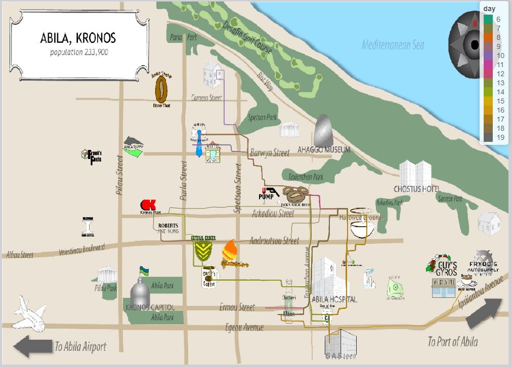{width=100%} <br> _Fig.17 The moving path of CarID 1_ </p>
  
    <p style="text-align:center;"> {width=80%}  {width=80%} <br> _Fig.18 Transaction frequency of credit and loyalty card by day_ </p>
  
  + Set CarID =2 and get the moving path. The favorite place for the car owner are Bean There Done That, General Grocer and places near Guy's Gyros. Besides, it looks like the car owner stopped by Albert's Fine Clothing on 16th Jan, as shown in the GPS tracking below. Thus the owner of credit card 7819 and loyalty card L5259 is most likely the owner of CarID 2, as shown in the following 2d histograms.
  
    <p style="text-align:center;"> 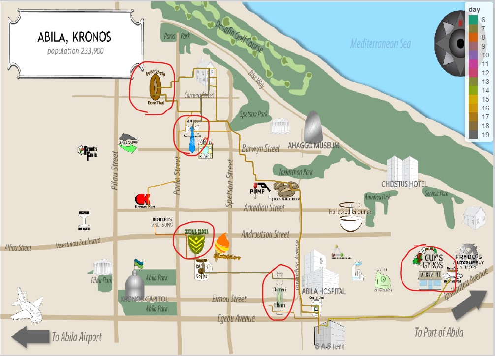{width=100%} {width=60%} <br> _Fig.19 The moving path of CarID 2_ </p>
    
    <p style="text-align:center;"> 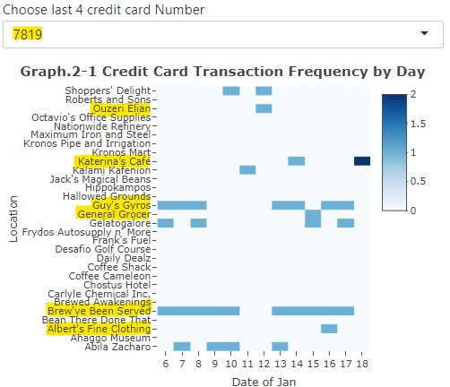{width=80%}  {width=80%} <br> _Fig.20 Transaction frequency of credit and loyalty card by day_ </p>
    
  + Set CarID = 3 and and get the moving path as shown below, which looks quite similar to CarID 2. Thus the owner of credit card 1877 and loyalty card L3014, which is the most similar to credit card 6895 and loyalty card L3366, is most like the owner of CarID 3,
  
    <p style="text-align:center;"> {width=100%} <br> _Fig.21 The moving path of CarID 3_ </p>
    
    <p style="text-align:center;"> {width=80%}  {width=80%} <br> _Fig.22 Transaction frequency of credit and loyalty card by day_ </p>
  
  + Set CarID = 4 and get the movement path as shown below, and it's obvious that the car was parked at Desafio Golf Course on 12th and 19th of Jan. similar to the above logic, compare the frequently visited spots shown in path and the consumption mode displayed by 2d histograms of credit card, and found the most similar pair of CarID owner and credit card owner, then according to the credit card find the loyalty card with the most similar transaction frequency shown by 2d histogram. Thus the owner of CarID 4 is most likely the owner of credit card 7688 and loyalty card L4164.
  
    <p style="text-align:center;"> {width=100%} 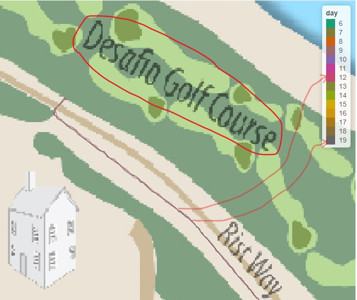{width=100%} <br> _Fig.23 The moving path of CarID 4_ </p>
    
    <p style="text-align:center;"> {width=80%}  {width=80%} <br> _Fig.24 Transaction frequency of credit and loyalty card by day_ </p>
    
  + Set CarID = 5 and get the movement path as shown below. It looks like the car stopped by Kronos Mart on 14th of Jan. Then according to comparison with following 2d histograms, the owner of CarID 5 is most likely the owner of credit card 6899 and loyalty card L6267.
  
    <p style="text-align:center;"> 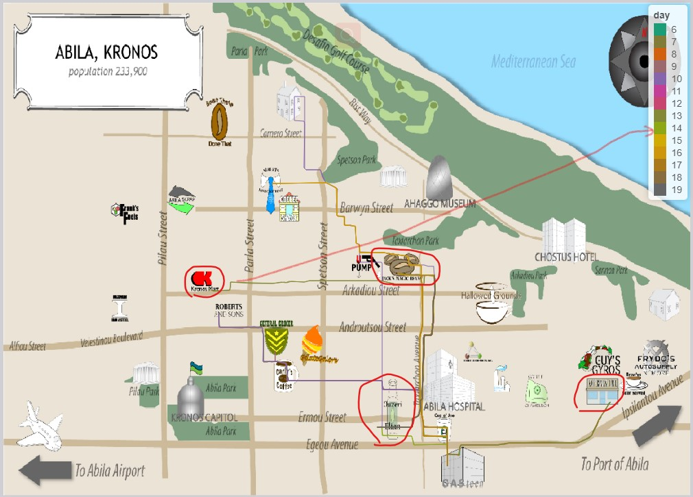{width=100%} <br> _Fig.25 The moving path of CarID 5_ </p>
    
    <p style="text-align:center;"> 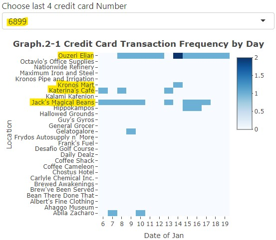{width=80%}  {width=80%} <br> _Fig.26 Transaction frequency of credit and loyalty card by day_ </p>
  
  + Set CarID = 6 and get the movement path as shown below. According to comparison with following 2d histograms, the owner of CarID 6 is most likely the owner of credit card 4434 and loyalty card L2169.
  
    <p style="text-align:center;"> {width=100%} <br> _Fig.27 The moving path of CarID 6_ </p>
    
    <p style="text-align:center;"> {width=80%}  {width=80%} <br> _Fig.28 Transaction frequency of credit and loyalty card by day_ </p>
    
  + Set CarID = 7 and get the movement path as shown below. According to comparison with following 2d histograms, the owner of CarID 7 is most likely the owner of credit card 2540 and loyalty card L7291.
  
    <p style="text-align:center;"> {width=100%} <br> _Fig.29 The moving path of CarID 7_ </p>
    
    <p style="text-align:center;"> {width=80%} 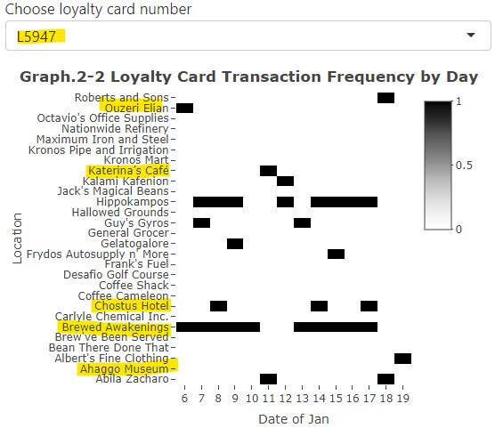{width=80%} <br> _Fig.30 Transaction frequency of credit and loyalty card by day_ </p>
    
  + Set CarID = 8 and get the movement path as shown below. According to comparison with following 2d histograms, the owner of CarID 8 is most likely the owner of credit card 3484 and loyalty card L2490.
  
    <p style="text-align:center;"> {width=100%} <br> _Fig.31 The moving path of CarID 8_ </p>
    
    <p style="text-align:center;"> {width=80%} {width=80%} <br> _Fig.32 Transaction frequency of credit and loyalty card by day_ </p>
  
  + Set CarID = 9 and get the movement path as shown below. According to comparison with following 2d histograms, the owner of CarID 9 is most likely the owner of credit card 1321 and loyalty card L4149.
  
    <p style="text-align:center;"> {width=100%} <br> _Fig.33 The moving path of CarID 9_ </p>
    
    <p style="text-align:center;"> {width=80%}  {width=80%} <br> _Fig.34 Transaction frequency of credit and loyalty card by day_ </p>
    
  + Set CarID = 10 and get the movement path as shown below. According to comparison with following 2d histograms, the owner of CarID 10 is most likely the owner of credit card 8332 and loyalty card L2070.
  
    <p style="text-align:center;"> {width=100%} <br> _Fig.35 The moving path of CarID 10_ </p>
    
    <p style="text-align:center;"> {width=80%}  {width=80%} <br> _Fig.36 Transaction frequency of credit and loyalty card by day_ </p>

  + Set CarID = 11 and get the movement path as shown below. According to comparison with following 2d histograms, the owner of CarID 11 is most likely the owner of credit card 1415 and loyalty card L7783.
  
    <p style="text-align:center;"> {width=100%} <br> _Fig.37 The moving path of CarID 11_ </p>
    
    <p style="text-align:center;"> {width=80%}  {width=80%} <br> _Fig.38 Transaction frequency of credit and loyalty card by day_ </p>

  + Set CarID = 12 and get the movement path as shown below. According to comparison with following 2d histograms, the owner of CarID 12 is most likely the owner of credit card 7792 and loyalty card L5756.
  
    <p style="text-align:center;"> {width=100%} <br> _Fig.39 The moving path of CarID 12_ </p>
    
    <p style="text-align:center;"> {width=80%} {width=80%} <br> _Fig.40 Transaction frequency of credit and loyalty card by day_ </p>

  + Set CarID = 13 and get the movement path as shown below. According to comparison with following 2d histograms, the owner of CarID 13 is most likely the owner of credit card 5407 and loyalty card L4034.
  
    <p style="text-align:center;"> {width=100%} <br> _Fig.41 The moving path of CarID 13_ </p>
    
    <p style="text-align:center;"> {width=80%} 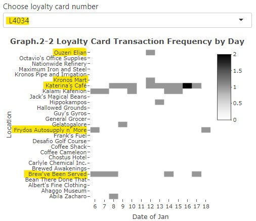{width=80%} <br> _Fig.42 Transaction frequency of credit and loyalty card by day_ </p>
    
  + Set CarID = 14 and get the movement path as shown below. According to comparison with following 2d histograms, the owner of CarID 14 is most likely the owner of credit card 9617 and loyalty card L5553.
  
    <p style="text-align:center;"> {width=100%} <br> _Fig.43 The moving path of CarID 14_ </p>
    
    <p style="text-align:center;"> {width=80%} {width=80%} <br> _Fig.44 Transaction frequency of credit and loyalty card by day_ </p>

  + Set CarID = 15 and get the movement path as shown below. According to comparison with following 2d histograms, especially the car it stopped by Frank's Fuels on 8th Jan as shown in Fig.45, the owner of CarID 15 is most likely the owner of credit card 3853 and loyalty card L1485.
  
    <p style="text-align:center;"> {width=100%} {width=80%} <br>  _Fig.45 The moving path of CarID 15_ </p>
    
    <p style="text-align:center;"> {width=80%} {width=80%} <br> _Fig.46 Transaction frequency of credit and loyalty card by day_ </p>
    
  + Set CarID = 16 and get the movement path as shown below. According to comparison with following 2d histograms, especially the car looks like it was parked at Roberts and Sons twice, the owner of CarID 16 is most likely the owner of credit card 7354 and loyalty card L9254.
  
    <p style="text-align:center;"> {width=100%} <br>  _Fig.47 The moving path of CarID 16_ </p>
    
    <p style="text-align:center;"> {width=80%} {width=80%} <br> _Fig.48 Transaction frequency of credit and loyalty card by day_ </p>

  + Set CarID = 17 and get the movement path as shown below. According to comparison with following 2d histograms, especially the car looks like it stopped by Ahaggo Museum on 17th Jan, and Ouzeri Elian on 19th Jan as shown in Fig.49, the owner of CarID 17 is most likely the owner of credit card 7384 and loyalty card L3800.
  
    <p style="text-align:center;"> {width=100%} {width=60%} {width=60%} <br>  _Fig.49 The moving path of CarID 17_ </p>
    
    <p style="text-align:center;"> {width=80%} {width=80%} <br> _Fig.50 Transaction frequency of credit and loyalty card by day_ </p>

  + Set CarID = 18 and get the movement path as shown below. According to comparison with following 2d histograms, especially the car looks like it was parked at General Grocer on 11th Jan, as shown in the figure below, the owner of CarID 18 is most likely the owner of credit card 8129 and loyalty card L8328.
  
    <p style="text-align:center;"> {width=100%} {width=60%} <br>  _Fig.51 The moving path of CarID 18_ </p>
    
    <p style="text-align:center;"> {width=80%} {width=80%} <br> _Fig.52 Transaction frequency of credit and loyalty card by day_ </p>

  + Set CarID = 19 and get the movement path as shown below. According to comparison with following 2d histograms, especially the car looks like it stopped by General Grocer on 19th Jan, as well as Ouzeri Elian around 6th, 7th and 18th of Jan, as shown in the figure below, the owner of CarID 19 is most likely the owner of credit card 6895 and loyalty card L3366.
  
    <p style="text-align:center;"> {width=100%} {width=60%} {width=60%} <br>  _Fig.53 The moving path of CarID 19_ </p>
    
    <p style="text-align:center;"> {width=80%} {width=80%} <br> _Fig.54 Transaction frequency of credit and loyalty card by day_ </p>
    
  + Set CarID = 20 and get the movement path as shown below. According to comparison with following 2d histograms, the owner of CarID 20 is most likely the owner of credit card 5368 and loyalty card L2247.
  
    <p style="text-align:center;"> {width=100%} <br>  _Fig.55 The moving path of CarID 20_ </p>
    
    <p style="text-align:center;"> {width=80%} {width=80%} <br> _Fig.56 Transaction frequency of credit and loyalty card by day_ </p>
    
  + Set CarID = 21 and get the movement path as shown below. According to comparison with following 2d histograms, the owner of CarID 21 is most likely the owner of credit card 1286 and loyalty card L3572.
  
    <p style="text-align:center;"> {width=100%} <br>  _Fig.57 The moving path of CarID 21_ </p>
    
    <p style="text-align:center;"> {width=80%} {width=80%} <br> _Fig.58 Transaction frequency of credit and loyalty card by day_ </p>

  + Set CarID = 22 and get the movement path as shown below. According to comparison with following 2d histograms, the owner of CarID 22 is most likely the owner of credit card 4498 and loyalty card L9406.
  
    <p style="text-align:center;"> {width=100%} <br>  _Fig.59 The moving path of CarID 22_ </p>
    
    <p style="text-align:center;"> {width=80%} {width=80%} <br> _Fig.60 Transaction frequency of credit and loyalty card by day_ </p>

  + Set CarID = 23 and get the movement path as shown below. According to comparison with following 2d histograms, especially the car looks like was parked at Coffee Shack on 14th Jan, as shown in Fig.61, the owner of CarID 23 is most likely the owner of credit card 7117 and loyalty card L6417.
  
    <p style="text-align:center;"> {width=100%} {width=60%} <br>  _Fig.61 The moving path of CarID 23_ </p>
    
    <p style="text-align:center;"> {width=80%} {width=80%} <br> _Fig.62 Transaction frequency of credit and loyalty card by day_ </p>

  + Set CarID = 24 and get the movement path as shown below. It looks like the car was parted at Roberts and Sons on 14th Jan. According to comparison with following 2d histograms, the owner of CarID 24 is most likely the owner of credit card 9405 and loyalty card L3259.
  
    <p style="text-align:center;"> {width=100%} {width=60%} <br>  _Fig.63 The moving path of CarID 24_ </p>
    
    <p style="text-align:center;"> 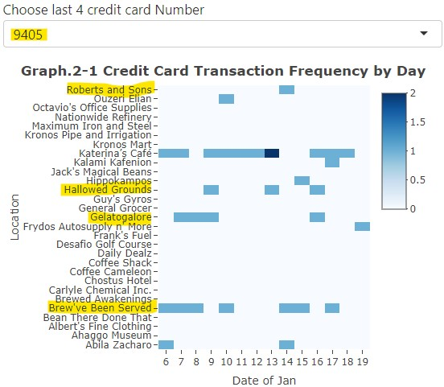{width=80%} 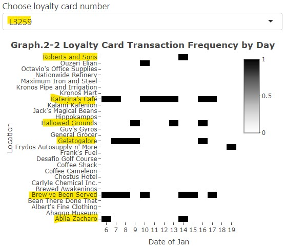{width=80%} <br> _Fig.64 Transaction frequency of credit and loyalty card by day_ </p>

  + Set CarID = 25 and get the movement path as shown below. According to comparison with following 2d histograms, the owner of CarID 25 is most likely the owner of credit card 2142 and loyalty card L9637.
  
    <p style="text-align:center;"> {width=100%}  <br>  _Fig.65 The moving path of CarID 25_ </p>
    
    <p style="text-align:center;"> 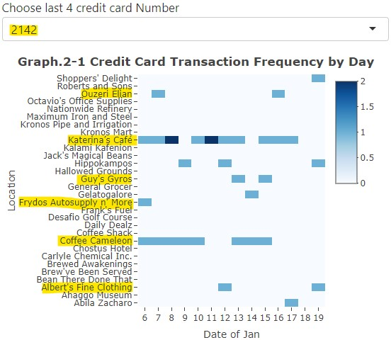{width=80%} {width=80%} <br> _Fig.66 Transaction frequency of credit and loyalty card by day_ </p>

  + Set CarID = 26 and get the movement path as shown below. According to comparison with following 2d histograms, especially the car looks like was parked at Roberts And Sons on 11th Jan as shown in Fig.67, the owner of CarID 26 is most likely the owner of credit card 1310 and loyalty card L8012.
  
    <p style="text-align:center;"> {width=100%} {width=60%} <br>  _Fig.67 The moving path of CarID 26_ </p>
    
    <p style="text-align:center;"> {width=80%} {width=80%} <br> _Fig.68 Transaction frequency of credit and loyalty card by day_ </p>

  + Set CarID = 27 and get the movement path as shown below. According to comparison with following 2d histograms, the owner of CarID 27 is most likely the owner of credit card 3492 and loyalty card L7814.
  
    <p style="text-align:center;"> {width=100%} <br>  _Fig.69 The moving path of CarID 27_ </p>
    
    <p style="text-align:center;"> {width=80%} {width=80%} <br> _Fig.70 Transaction frequency of credit and loyalty card by day_ </p>

  + Set CarID = 28 and get the movement path as shown below.There is noise and positioning deviation in the GPS tracking data, and it looks like the car was parked at Ahggo Museum and Frydos Autosupply on 19th and 6th of Jan respectively. According to comparison with following 2d histograms, the owner of CarID 28 is most likely the owner of credit card 9241 and loyalty card L3288.
  
    <p style="text-align:center;"> 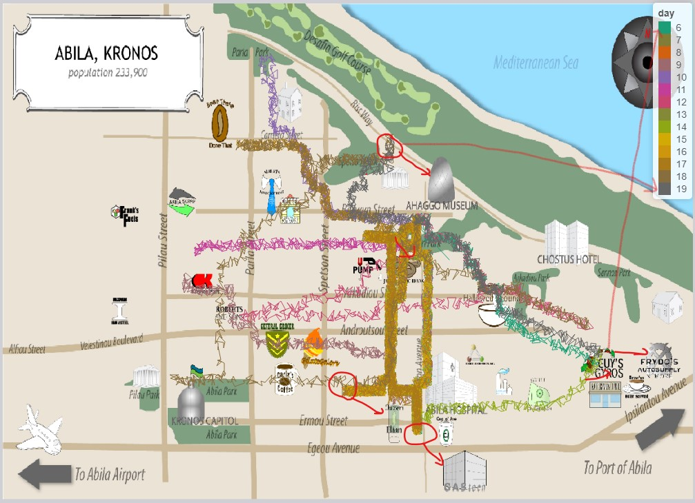{width=100%} <br>  _Fig.71 The moving path of CarID 28_ </p>
    
    <p style="text-align:center;"> 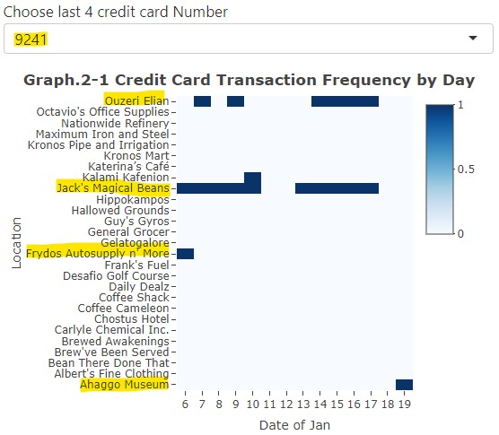{width=80%} 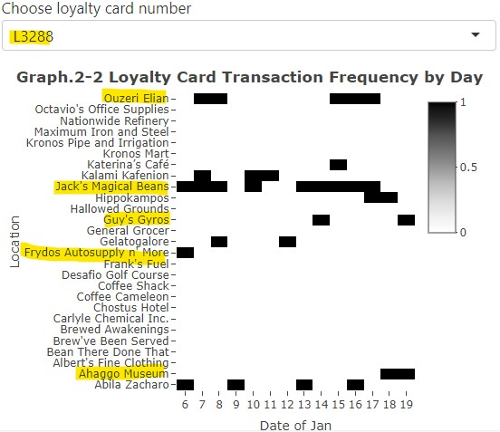{width=80%} <br> _Fig.72 Transaction frequency of credit and loyalty card by day_ </p>

  + Set CarID = 29 and get the movement path as shown below. According to comparison with following 2d histograms, the owner of CarID 29 is most likely the owner of credit card 2418 and loyalty card L9018.
  
    <p style="text-align:center;"> {width=100%} <br>  _Fig.73 The moving path of CarID 29_ </p>
    
    <p style="text-align:center;"> {width=80%} {width=80%} <br> _Fig.74 Transaction frequency of credit and loyalty card by day_ </p>

  + Set CarID = 30 and get the movement path as shown below. According to comparison with following 2d histograms, especially the car looks like was parked at Ahaggo Museum on 12th Jan as shown in Fig.75, the owner of CarID 30 is most likely the owner of credit card 6901 and loyalty card L9363.
  
    <p style="text-align:center;"> {width=100%} {width=60%} <br>  _Fig.75 The moving path of CarID 30_ </p>
    
    <p style="text-align:center;"> {width=80%} {width=80%} <br> _Fig.76 Transaction frequency of credit and loyalty card by day_ </p>

  + Set CarID = 31 and get the movement path as shown below，and it's obvious that the car was parked at Desafio Golf Course on 19th Jan, and only have tracking data from 17th to 19th Jan. According to comparison with following 2d histograms, the owner of CarID 31 is most likely the owner of credit card 5010 and loyalty card L2459.
  
    <p style="text-align:center;"> {width=100%}  <br>  _Fig.77 The moving path of CarID 31_ </p>
    
    <p style="text-align:center;"> {width=80%} {width=80%} <br> _Fig.78 Transaction frequency of credit and loyalty card by day_ </p>

  + Set CarID = 32 and get the movement path as shown below. It's obvious that the car was parked at Desafio Golf Course on 19th Jan. According to comparison with following 2d histograms, the owner of CarID 32 is most likely the owner of credit card 8156 and loyalty card L5224.
  
    <p style="text-align:center;"> {width=100%}  <br>  _Fig.79 The moving path of CarID 32_ </p>
    
    <p style="text-align:center;"> {width=80%} {width=80%} <br> _Fig.80 Transaction frequency of credit and loyalty card by day_ </p>

  + Set CarID = 33 and get the movement path as shown below. It's obvious that the car was parked at Ahaggo Museum on 11th Jan, as well as Chostus Hotel on 8th, 10th, 14th and 17th of Jan. According to comparison with following 2d histograms, the owner of CarID 33 is most likely the owner of credit card 9683 and loyalty card L7291.
  
    <p style="text-align:center;"> {width=100%} {width=60%} {width=60%} <br>  _Fig.81 The moving path of CarID 33_ </p>
    
    <p style="text-align:center;"> {width=80%} {width=80%} <br> _Fig.82 Transaction frequency of credit and loyalty card by day_ </p>

  + Set CarID = 34 and get the movement path as shown below. It's obvious that the car was parked at Ahaggo Museum on 11th Jan. According to comparison with following 2d histograms, the owner of CarID 34 is most likely the owner of credit card 4795 and loyalty card L8566.
  
    <p style="text-align:center;"> {width=100%} {width=60%} <br>  _Fig.83 The moving path of CarID 34_ </p>
    
    <p style="text-align:center;"> {width=80%} {width=80%} <br> _Fig.84 Transaction frequency of credit and loyalty card by day_ </p>
    
  + Set CarID = 35 and get the movement path as shown below. It's obvious that the car was parked at Desafio Golf Course on 12th and 19th of Jan. According to comparison with following 2d histograms, the owner of CarID 35 is most likely the owner of credit card 2463 and loyalty card L6886.
  
    <p style="text-align:center;"> {width=100%} {width=60%} <br>  _Fig.85 The moving path of CarID 35_ </p>
    
    <p style="text-align:center;"> {width=80%} {width=80%} <br> _Fig.86 Transaction frequency of credit and loyalty card by day_ </p>    


As conclusion, the matching result between owner of assigned car and cards is shown below:

```{r echo=FALSE}
owner_match <- read_csv("data/car-card-match.csv") %>%
  select(-CarID) %>%
  rename("Credit card num" = "CC", "Loyalty card num" = "Loyalty")

owner_match$`Credit card num` = as.character(owner_match$`Credit card num`)

owner_match <- cbind(filter(car_ass, is.na(CarID) == F), owner_match)
knitr::kable(owner_match, caption = "The owner of credit and loyalty cards")  
```


* **Where are there uncertainties in your method? Where are there uncertainties in the data? **

  + I was finding the owner of Cards by match the GPS tracking data and transaction records. However the place of consumption recorded by credit and loyalty card and the spots that cars had passed by can't be matched in precision. Because the place where the car stopped may not necessarily have consumption, and people may go out in other vehicles, not necessarily in the assigned cars.
  
  + GPS positioning may be inaccurate, as I already found obviously noise data and excursion of positioning in the moving path of CarID 5. So not sure if other GPS tracking data also have inaccurate positioning issues.

  + Some places have transaction records are not labeled in the map, such as  Shoppers' Delight, Octavio's Office Supplies, Kalami Kafenion, Hippokampos and Abila Zacharo, some of which even have lots of consumption records.And what these places are used for is also uncertain.
  
  + The number of credit car and loyalty card is much more then the number of cars assigned to individuals, thus not sure if there are some members of staff hold multiple cards.

## 4.4 Anlysis for question 4

* **Given the data sources provided, identify potential informal or unofficial relationships among GASTech personnel. Provide evidence for these relationships.**

  According to the analysis above, some people have highly overlapped moving path records, as listed below. Thus it's reasonable to infer these people have informal relationships.

  + Brand Tempestad and Edvard Vann: These two people are the car owners of CarID 33 and 34. Seeing the moving path below, their moving path looks quite similar, and it seems they went to Ahaggo Museum together, the place near Brew've Been Served and Roberts and Sons at the same days.
    
    {width=80%} {width=80%} <br> _Fig.87 Moving path of CarID 33 (figure above) and 34 (figure below)_ 
  
  + Stenig Fusil and Edvard Vann: These two people are the car owners of CarID 20 and 34. Seeing the moving path below, they have similar path in the place near Brew've Been Served and Roberts and Sons at the same days. 
  
    {width=80%} {width=80%} <br> _Fig.88 Moving path of CarID 20 (figure above) and 34 (figure below)_ 
  
  + Lars Azada, Felix Balas, Gustav Cazar, Axel Calzas and Vira Frente: They are the car owners of CarID 2, 3, 9, 11 and 19. Seeing the figures below, they have quite similar moving path in same days passing by Bean There Done That, Albert's Fine Clothing, Jack's Magic Beans and GASTech. 
  
    {width=80%} {width=80%} {width=80%} {width=80%} {width=80%} <br> _Fig.89 Moving path of CarID 2, 3, 9, 11 and 19_ 
  
  + Inga Ferro, Loreto Bodrogi and Hennie Osvaldo: These two people are the car owners of CarID 13, 15 and 21. Seeing the moving path below, their moving path are highly overlapped, especially the route which passing by the places near Katherina's Cafe, Kronos Mart, Ahaggo Museum, Jack's Magic Bean and Albert's Fine Clothing. And they visited Katherina's Cafe, Frydos Autosupply, Guy's Gyros and Brew've Been Served quite often.
  
    {width=80%} {width=80%} {width=80%} <br> _Fig.90 Moving path of CarID 13 (above), 15 (middle) and 21 (below)_ 

  + Adra Nubarron, Varja Lagos and Felix Resumir: They are the car owners of CarID 22, 23 and 30. Seeing the figures below, they have quite similar moving path in same days passing by the places near Katherina's Cafe, Kronos Mart, Ouzeri Elian, Roberts And Sons, Kronos Mart, Jack's Magic Beans and Albert's Fine Clothing.
  
    {width=80%} {width=80%} {width=80%} <br> _Fig.91 Moving path of CarID 22 (above), 23 (middle) and 30 (below)_ 

## 4.5 Anlysis for question 5

* **Do you see evidence of suspicious activity? **

  Katherina's Cafe are the places I think may have suspicious activity. As what have been spotted and analyzed, Katherina's Cafe, the place close to GASTech company, are very popular among GASTech staff. But many of them had gathered at this place on Saturday and stay till 8PM, which is abnormal. Below table lists all credit card transaction records in Katherina's Cafe after 7PM on Saturday.
  
```{r echo=FALSE}
Kather_tr <- cc %>%
  filter(location == "Katerina’s Café",
         weekday == "Sat",
         hour > 18)

pp_list <- c(Kather_tr$last4ccnum)

knitr::kable(Kather_tr, 
             caption = "Credit card transaction records in Katherina's Cafe after 7PM on Saturday", 
             longtable = T,
             align = "llccccc")
```
  
  According to the transaction records picked out above, people who have gathered at Katherina's Cafe on Saturday after 7PM are listed in following table. Compare this name list with what have been found on the informal relationships between staff, it's obvious the people listed below don't have apparent formal relationships. Thus it's highly suspicious why they gathered at Katherina's Cafe at the same time on Saturday.
  
```{r echo=FALSE}
Kather_pp <- owner_match %>%
  filter(`Credit card num` %in% pp_list) 

knitr::kable(Kather_pp, caption = "People with credit card transaction records in Katherina's Cafe after 7 PM on Saturday")
```


# 5. Conclusion

According to what have been stated above, as the first step, I pointed out some abnormal transaction records and compared them with GPS tracking data. The initial abnormal records found happened in Krnos Mart, Frydos Autosupply n’ More, Daily Dealz, Hippokampos and Katherina’s Cafe.

Secondly, the owners of credit and loyalty cards were identified by comparing the places having consumption and the moving path shown by GPS tracking data. I tried to observe the spots visited by each car assigned to individuals, and found the common places having transactions recorded in credit and loyalty cards in the same days. Then match the owner of cars and the owner of credit and loyalty card one by one. Then the unofficial relationships between GASTech personnel were recognized by further comparing the GPS tracking line of different cars and finding similar or overlapped moving route in same days.

Finally, integrating all the results of analysis, Katherina's Cafe is doubt for having suspicious activity, since the people gathered here after 7PM on Saturday don't have obvious informal relationship.
